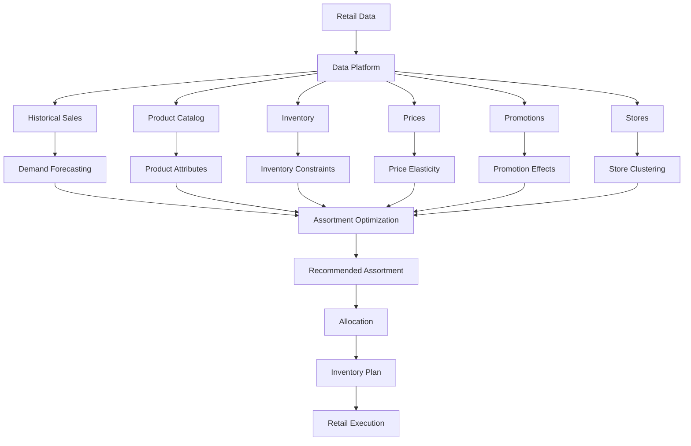
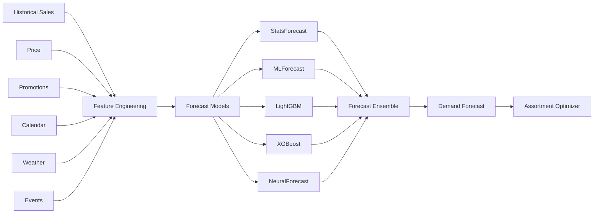

# Awesome-Retail-Assortment-Planning

# 🛍️ Top Retail Assortment Planning Platforms & Open-Source Software


> A curated list of **Retail Assortment Planning platforms, merchandise planning systems, demand forecasting tools, inventory optimization software, assortment optimization algorithms and open-source building blocks** for modern retail.


Retail assortment planning determines **which products should be offered, where they should be offered, in what quantities, for which selling periods, and at what price/margin targets**.


Modern assortment planning combines:


* Assortment optimization

* Demand forecasting

* Customer choice modeling

* Product clustering

* Localization

* Cannibalization analysis

* New-product forecasting

* Price elasticity

* Inventory optimization

* Allocation

* Space planning

* Markdown optimization

* Scenario planning

* Financial planning

* Promotion planning

* Supply-chain constraints


This repository focuses primarily on **open-source and self-hostable alternatives**, while maintaining a separate list of commercial platforms such as **o9 Solutions, RELEX Solutions, Blue Yonder, Oracle Retail, JustEnough, Aptos, Anaplan, Invent Analytics, Board and ToolsGroup**.


> **Important:** Unlike areas such as databases or web infrastructure, there is no single mature open-source project that completely replicates an enterprise retail assortment-planning suite. The strongest open-source approach is therefore **composable**: combine forecasting, optimization, choice modeling, inventory optimization, data infrastructure and retail applications.


A practical open-source assortment-planning stack can look like:


```text

                         RETAIL DATA

                              │

               ┌──────────────┼──────────────┐

               ▼              ▼              ▼

             Sales         Products        Inventory

               │              │              │

               └──────────────┼──────────────┘

                              ▼

                       Demand Forecasting

                              │

                              ▼

                       Customer Choice

                              │

                              ▼

                     Assortment Optimization

                              │

              ┌───────────────┼───────────────┐

              ▼               ▼               ▼

          Localization      Margin        Inventory

              │               │               │

              └───────────────┼───────────────┘

                              ▼

                       Final Assortment

```


---


## 📑 Table of Contents


* [☁️ SaaS/Hosted Platforms](#️-saashosted-platforms)

* [🌍 Open-Source](#-open-source)

* [🛒 Open-Source Retail Planning Platforms](#-open-source-retail-planning-platforms)

* [📈 Open-Source Demand Forecasting](#-open-source-demand-forecasting)

* [🎯 Open-Source Assortment Optimization](#-open-source-assortment-optimization)

* [🧠 Open-Source Customer Choice Models](#-open-source-customer-choice-models)

* [📦 Open-Source Inventory Optimization](#-open-source-inventory-optimization)

* [⚙️ Open-Source Mathematical Optimization](#️-open-source-mathematical-optimization)

* [💰 Open-Source Pricing & Revenue Optimization](#-open-source-pricing--revenue-optimization)

* [🏷️ Open-Source Retail & ERP Platforms](#️-open-source-retail--erp-platforms)

* [📊 Open-Source Retail Analytics](#-open-source-retail-analytics)

* [🧮 Open-Source Simulation](#-open-source-simulation)

* [🔮 Open-Source Time-Series Forecasting](#-open-source-time-series-forecasting)

* [🧩 Commercial Platform → Open-Source Equivalent](#-commercial-platform--open-source-equivalent)

* [🏗️ Retail Assortment Planning Architecture](#️-retail-assortment-planning-architecture)

* [🔄 Open-Source Assortment Optimization Architecture](#-open-source-assortment-optimization-architecture)

* [📈 Demand Forecasting Architecture](#-demand-forecasting-architecture)

* [🎯 Assortment Optimization Workflow](#-assortment-optimization-workflow)

* [⚖️ Commercial vs Open-Source](#️-commercial-vs-open-source)

* [🚀 Recommended Open-Source Stacks](#-recommended-open-source-stacks)

* [📊 Technology Comparison](#-technology-comparison)

* [🎯 Recommended Projects by Use Case](#-recommended-projects-by-use-case)

* [🏢 Building an o9 / RELEX Alternative](#-building-an-o9--relex-alternative)

* [🧱 Building an Open-Source Retail Planning Platform](#-building-an-open-source-retail-planning-platform)

* [🌐 Open-Source Retail Planning Landscape](#-open-source-retail-planning-landscape)

* [🧠 Why Open-Source Assortment Planning Matters](#-why-open-source-assortment-planning-matters)

* [🤝 Contributing](#-contributing)

* [⚠️ Disclaimer](#️-disclaimer)


---


# ☁️ SaaS/Hosted Platforms


Commercial retail planning platforms combine assortment, merchandise, demand, inventory and financial planning into integrated enterprise applications.


| Platform                                                          | Company              | Primary Focus              | Key Capabilities                                               |

| ----------------------------------------------------------------- | -------------------- | -------------------------- | -------------------------------------------------------------- |

| [o9 Solutions](https://o9solutions.com/)                          | o9 Solutions         | Integrated retail planning | Assortment, merchandise, demand, supply and financial planning |

| [RELEX Solutions](https://www.relexsolutions.com/)                | RELEX Solutions      | Retail optimization        | Assortment, demand, replenishment, allocation and pricing      |

| [Blue Yonder](https://blueyonder.com/)                            | Blue Yonder          | Retail planning            | Assortment, merchandise, demand, allocation and supply chain   |

| [Oracle Retail](https://www.oracle.com/retail/)                   | Oracle               | Enterprise retail          | Assortment, merchandise planning, allocation and inventory     |

| [JustEnough](https://www.justenough.com/)                         | JustEnough           | Merchandise planning       | Assortment, inventory and merchandise optimization             |

| [Aptos](https://www.aptos.com/)                                   | Aptos                | Retail planning            | Merchandise, assortment, allocation and planning               |

| [Anaplan](https://www.anaplan.com/solutions/assortment-planning/) | Anaplan              | Connected planning         | Assortment, financial, merchandise and scenario planning       |

| [Invent Analytics](https://inventanalytics.com/)                  | Invent Analytics     | Retail optimization        | Inventory, assortment, pricing and demand optimization         |

| [Board](https://www.board.com/)                                   | Board                | Enterprise planning        | Retail planning, forecasting, analytics and scenario modeling  |

| [ToolsGroup](https://www.toolsgroup.com/)                         | ToolsGroup           | Supply-chain optimization  | Demand forecasting, inventory and assortment optimization      |

| [SAP](https://www.sap.com/industries/retail.html)                 | SAP                  | Retail planning            | Merchandise planning, demand, inventory and supply chain       |

| [Manhattan Associates](https://www.manh.com/)                     | Manhattan Associates | Supply-chain / retail      | Allocation, inventory, planning and fulfillment                |

| [RELEX](https://www.relexsolutions.com/)                          | RELEX                | Retail optimization        | AI forecasting, assortment, pricing and replenishment          |

| [Nextail](https://nextail.co/)                                    | Nextail              | Retail merchandising       | Assortment, allocation, pricing and merchandising optimization |

| [Aptos Planning](https://www.aptos.com/)                          | Aptos                | Merchandise planning       | Assortment, merchandise financial planning and allocation      |


Anaplan's current assortment-planning application, for example, combines AI forecasting, localization, scenario planning, newness forecasting, complementarity and cannibalization analysis.


---


# 🌍 Open-Source


Open-source assortment planning is best viewed as a **technology stack rather than a single application**.


```text

                       OPEN-SOURCE RETAIL PLANNING

                                  │

          ┌───────────────────────┼───────────────────────┐

          │                       │                       │

          ▼                       ▼                       ▼

      Forecasting            Optimization             Retail ERP

          │                       │                       │

          ▼                       ▼                       ▼

     Nixtla / Darts          OR-Tools / Pyomo        ERPNext / Odoo

     GluonTS / MLForecast    OptaPlanner              OpenBoxes

          │                       │

          └───────────────┬───────┘

                          ▼

                  Assortment Engine

                          │

             ┌────────────┼────────────┐

             ▼            ▼            ▼

         Choice Model   Inventory    Pricing

             │         Optimization  Optimization

             └────────────┼────────────┘

                          ▼

                    Retail Planner

```


There are a few projects specifically implementing assortment optimization. For example, `hugopalmer/assortment_optimization` implements a data-driven assortment-optimization workflow involving choice-model learning and assortment optimization, while `IP_Assortment_CODE` implements an integer-programming approach to quick-commerce assortment planning.


---


# 🛒 Open-Source Retail Planning Platforms


There is no universally dominant open-source equivalent of **o9 / RELEX / Blue Yonder / Oracle Retail**. Instead, these projects provide different parts of the planning stack.


| Project                                                   | Primary Role             | Relevance                                                     |

| --------------------------------------------------------- | ------------------------ | ------------------------------------------------------------- |

| [ERPNext](https://github.com/frappe/erpnext)              | Open-source ERP          | Products, sales, purchasing, inventory and financial planning |

| [Odoo Community](https://github.com/odoo/odoo)            | ERP / retail             | Products, inventory, sales and purchasing                     |

| [OpenBoxes](https://github.com/openboxes/openboxes)       | Inventory / supply chain | Inventory, warehouses and stock movements                     |

| [Apache OFBiz](https://github.com/apache/ofbiz-framework) | ERP / commerce           | Product, order, inventory and supply-chain workflows          |

| [Openbravo](https://www.openbravo.com/)                   | Retail ERP               | Retail and commerce infrastructure                            |

| [Dolibarr](https://github.com/Dolibarr/dolibarr)          | ERP / CRM                | Products, inventory, orders and purchasing                    |

| [Saleor](https://github.com/saleor/saleor)                | Commerce platform        | Products, catalogs, orders and channels                       |

| [Medusa](https://github.com/medusajs/medusa)              | Commerce infrastructure  | Product catalog and commerce APIs                             |

| [OpenBoxes](https://github.com/openboxes/openboxes)       | Supply-chain management  | Warehouse and inventory operations                            |


OpenBoxes is a particularly useful open-source supply-chain building block because it provides inventory and stock-movement management and is explicitly designed as a general-purpose warehouse/supply-chain system.


---


# 📈 Open-Source Demand Forecasting


Demand forecasting is one of the most important inputs to assortment planning.


```text

Historical Sales

      │

      ▼

Seasonality ──────┐

Promotions ───────┤

Price ────────────┤

Weather ──────────┤

Events ───────────┤

Store ────────────┤

Product ──────────┤

Competitors ──────┘

      │

      ▼

Demand Forecast

      │

      ▼

Assortment Optimization

```


| Project                                                              | Description                              |

| -------------------------------------------------------------------- | ---------------------------------------- |

| [Nixtla / StatsForecast](https://github.com/Nixtla/statsforecast)    | High-performance statistical forecasting |

| [Nixtla / MLForecast](https://github.com/Nixtla/mlforecast)          | Machine-learning forecasting             |

| [Nixtla / NeuralForecast](https://github.com/Nixtla/neuralforecast)  | Neural forecasting                       |

| [Darts](https://github.com/unit8co/darts)                            | Time-series forecasting framework        |

| [GluonTS](https://github.com/awslabs/gluonts)                        | Probabilistic forecasting                |

| [PyTorch Forecasting](https://github.com/sktime/pytorch-forecasting) | Deep-learning forecasting                |

| [sktime](https://github.com/sktime/sktime)                           | Time-series ML                           |

| [Statsmodels](https://github.com/statsmodels/statsmodels)            | Statistical forecasting                  |

| [Prophet](https://github.com/facebook/prophet)                       | Business time-series forecasting         |

| [Kats](https://github.com/facebookresearch/Kats)                     | Time-series toolkit                      |

| [sktime](https://github.com/sktime/sktime)                           | Forecasting and time-series ML           |

| [AutoGluon-TimeSeries](https://github.com/autogluon/autogluon)       | Automated forecasting                    |

| [LightGBM](https://github.com/microsoft/LightGBM)                    | Gradient boosting                        |

| [XGBoost](https://github.com/dmlc/xgboost)                           | Gradient boosting                        |


A practical assortment planner can combine:


```text

StatsForecast

      +

MLForecast

      +

LightGBM / XGBoost

      +

Deep Forecasting

      =

Demand Forecast Ensemble

```


---


# 🎯 Open-Source Assortment Optimization


This is the most specialized part of the ecosystem.


| Project                                                                          | Approach                       | Focus                               |

| -------------------------------------------------------------------------------- | ------------------------------ | ----------------------------------- |

| [assortment_optimization](https://github.com/hugopalmer/assortment_optimization) | Choice modeling + optimization | Large-scale assortment optimization |

| [IP_Assortment_CODE](https://github.com/YLW2018/IP_Assortment_CODE)              | Integer Programming            | Quick-commerce assortment           |

| [Google OR-Tools](https://github.com/google/or-tools)                            | Mathematical optimization      | Custom assortment constraints       |

| [Pyomo](https://github.com/Pyomo/pyomo)                                          | Optimization modeling          | Custom assortment models            |

| [python-mip](https://github.com/coin-or/python-mip)                              | MILP                           | Assortment optimization             |

| [PuLP](https://github.com/coin-or/pulp)                                          | Linear programming             | Assortment constraints              |

| [CVXPY](https://github.com/cvxpy/cvxpy)                                          | Convex optimization            | Optimization models                 |

| [HiGHS](https://github.com/ERGO-Code/HiGHS)                                      | LP/MIP solver                  | Large optimization problems         |

| [SCIP](https://github.com/scipopt/scip)                                          | MIP / constraint optimization  | Complex assortment models           |

| [OptaPlanner](https://github.com/apache/incubator-kie-optaplanner)               | Constraint optimization        | Assortment / allocation constraints |


The `assortment_optimization` project is especially relevant because it explicitly implements the sequence **choice-model learning → generalization → assortment optimization**, rather than merely providing generic inventory optimization.


---


# 🧠 Open-Source Customer Choice Models


Assortment optimization is fundamentally related to **customer choice modeling**.


A simplified formulation is:


```text

                    CUSTOMER

                       │

                       ▼

                Available Products

                       │

           ┌───────────┼───────────┐

           ▼           ▼           ▼

        Product A   Product B   Product C

           │           │           │

           └───────────┼───────────┘

                       ▼

                  Choice Model

                       │

                       ▼

              Purchase Probability

                       │

                       ▼

              Assortment Optimization

```


Common open-source building blocks include:


| Project / Library                                                                | Use                                        |

| -------------------------------------------------------------------------------- | ------------------------------------------ |

| [statsmodels](https://github.com/statsmodels/statsmodels)                        | Statistical choice models                  |

| [scikit-learn](https://github.com/scikit-learn/scikit-learn)                     | Logistic / classification models           |

| [PyMC](https://github.com/pymc-devs/pymc)                                        | Bayesian choice models                     |

| [PyLogit](https://github.com/timothyb0912/pylogit)                               | Discrete choice modeling                   |

| [Biogeme](https://github.com/michelbierlaire/biogeme)                            | Discrete-choice estimation                 |

| [Larch](https://github.com/drdecisions/larch)                                    | Choice modeling                            |

| [assortment_optimization](https://github.com/hugopalmer/assortment_optimization) | Choice-model-based assortment optimization |


Typical models include:


* Multinomial Logit

* Nested Logit

* Mixed Logit

* Multinomial Probit

* Latent-class models

* Random-coefficient models

* Machine-learning choice models


---


# 📦 Open-Source Inventory Optimization


Assortment decisions cannot be separated from inventory availability.


| Project                                                                                                                     | Focus                                    |

| --------------------------------------------------------------------------------------------------------------------------- | ---------------------------------------- |

| [Google OR-Tools](https://github.com/google/or-tools)                                                                       | Inventory optimization models            |

| [Pyomo](https://github.com/Pyomo/pyomo)                                                                                     | Inventory optimization                   |

| [supplychainpy](https://github.com/KevinFasusi/supplychainpy)                                                               | Supply-chain analytics                   |

| [Stockpyl](https://github.com/LarrySnyder/stockpyl)                                                                         | Inventory / supply-chain models          |

| [SimPy](https://github.com/simpx/simpy)                                                                                     | Discrete-event inventory simulation      |

| [OpenBoxes](https://github.com/openboxes/openboxes)                                                                         | Inventory management                     |

| [ERPNext](https://github.com/frappe/erpnext)                                                                                | Inventory / purchasing                   |

| [Odoo Community](https://github.com/odoo/odoo)                                                                              | Inventory / replenishment                |

| [RetailOps](https://github.com/MarieGutiz/RetailOps)                                                                        | Retail inventory simulation              |

| [Retail Forecasting & Inventory Optimization](https://github.com/Tufan2416/Retail-Sales-Forecasting-Inventory-Optimization) | Forecasting + EOQ + safety stock         |

| [Forecast-Driven Inventory Control](https://github.com/PhongNguyen97/Forecast-Driven-Inventory-Control-Analytics)           | Forecast + inventory policy optimization |


Open-source retail projects increasingly combine forecasting with operational inventory decisions such as EOQ, reorder points and safety stock.


---


# ⚙️ Open-Source Mathematical Optimization


A serious assortment optimizer frequently becomes a **mixed-integer optimization problem**.


```text

Maximize:


Revenue

+ Margin

+ Customer Satisfaction

- Inventory Cost

- Markdown Cost

- Assortment Complexity

- Cannibalization


Subject to:


Store Capacity

Product Availability

Budget

Shelf Space

Supplier Constraints

Minimum Assortment Size

Maximum Assortment Size

Category Constraints

Brand Constraints

Inventory

Lead Times

```


| Framework                                                          |  LP | MILP |  CP | Nonlinear | Primary Language           |

| ------------------------------------------------------------------ | :-: | :--: | :-: | :-------: | -------------------------- |

| [OR-Tools](https://github.com/google/or-tools)                     |  ✅  |   ✅  |  ✅  |     ⚠️    | C++ / Python / Java / .NET |

| [Pyomo](https://github.com/Pyomo/pyomo)                            |  ✅  |   ✅  |  ✅  |     ✅     | Python                     |

| [PuLP](https://github.com/coin-or/pulp)                            |  ✅  |   ✅  |  ❌  |     ❌     | Python                     |

| [python-mip](https://github.com/coin-or/python-mip)                |  ✅  |   ✅  |  ❌  |     ❌     | Python                     |

| [CVXPY](https://github.com/cvxpy/cvxpy)                            |  ✅  |  ⚠️  |  ❌  |     ✅     | Python                     |

| [HiGHS](https://github.com/ERGO-Code/HiGHS)                        |  ✅  |   ✅  |  ❌  |     ⚠️    | C++                        |

| [SCIP](https://github.com/scipopt/scip)                            |  ✅  |   ✅  |  ✅  |     ✅     | C / C++                    |

| [OptaPlanner](https://github.com/apache/incubator-kie-optaplanner) |  ⚠️ |  ⚠️  |  ✅  |     ⚠️    | Java                       |


---


# 💰 Open-Source Pricing & Revenue Optimization


Pricing and assortment are closely connected.


A retailer may want to maximize:


```text

Total Profit

    =

Sales Revenue

    -

Product Cost

    -

Inventory Cost

    -

Markdown Cost

```


Useful open-source components:


| Project                                                      | Role                       |

| ------------------------------------------------------------ | -------------------------- |

| [OR-Tools](https://github.com/google/or-tools)               | Pricing optimization       |

| [Pyomo](https://github.com/Pyomo/pyomo)                      | Revenue optimization       |

| [CVXPY](https://github.com/cvxpy/cvxpy)                      | Mathematical optimization  |

| [scikit-learn](https://github.com/scikit-learn/scikit-learn) | Demand / price models      |

| [XGBoost](https://github.com/dmlc/xgboost)                   | Price-demand prediction    |

| [LightGBM](https://github.com/microsoft/LightGBM)            | Price-demand prediction    |

| [PyMC](https://github.com/pymc-devs/pymc)                    | Bayesian elasticity models |


---


# 🏷️ Open-Source Retail & ERP Platforms


These projects are not dedicated assortment-planning products, but they provide important retail data and operational layers.


| Project                                                   | Capabilities                                       |

| --------------------------------------------------------- | -------------------------------------------------- |

| [ERPNext](https://github.com/frappe/erpnext)              | Products, sales, purchasing, inventory, accounting |

| [Odoo Community](https://github.com/odoo/odoo)            | Products, inventory, POS, purchasing               |

| [Apache OFBiz](https://github.com/apache/ofbiz-framework) | Product catalog, orders, inventory                 |

| [OpenBoxes](https://github.com/openboxes/openboxes)       | Inventory and warehouse management                 |

| [Dolibarr](https://github.com/Dolibarr/dolibarr)          | ERP / CRM / inventory                              |

| [Saleor](https://github.com/saleor/saleor)                | Product catalog and commerce                       |

| [Medusa](https://github.com/medusajs/medusa)              | Commerce infrastructure                            |

| [Vendure](https://github.com/vendure-ecommerce/vendure)   | Headless commerce                                  |

| [Apache OFBiz](https://github.com/apache/ofbiz-framework) | Commerce / ERP                                     |

| [Openbravo](https://www.openbravo.com/)                   | Retail ERP                                         |


---


# 📊 Open-Source Retail Analytics


Assortment planning requires a large analytics layer.


| Project                                               | Role                   |

| ----------------------------------------------------- | ---------------------- |

| [Apache Superset](https://github.com/apache/superset) | BI / dashboards        |

| [Metabase](https://github.com/metabase/metabase)      | BI / analytics         |

| [Evidence](https://github.com/evidence-dev/evidence)  | Data applications      |

| [Grafana](https://github.com/grafana/grafana)         | Monitoring / analytics |

| [DuckDB](https://github.com/duckdb/duckdb)            | Analytical database    |

| [Polars](https://github.com/pola-rs/polars)           | Data processing        |

| [Pandas](https://github.com/pandas-dev/pandas)        | Data analysis          |

| [Apache Spark](https://github.com/apache/spark)       | Large-scale analytics  |

| [dbt Core](https://github.com/dbt-labs/dbt-core)      | Data transformation    |

| [Apache Airflow](https://github.com/apache/airflow)   | Data orchestration     |


---


# 🧮 Open-Source Simulation


Simulation is useful for testing assortment decisions before deploying them.


```text

                    ASSORTMENT

                         │

                         ▼

                  Demand Model

                         │

                         ▼

                  Monte Carlo

                         │

              ┌──────────┼──────────┐

              ▼          ▼          ▼

           Demand A   Demand B   Demand C

              │          │          │

              └──────────┼──────────┘

                         ▼

                    Inventory

                         │

                         ▼

                   Service Level

                         │

                         ▼

                   Profit / Cost

```


| Project                                              | Role                        |

| ---------------------------------------------------- | --------------------------- |

| [SimPy](https://github.com/simpx/simpy)              | Discrete-event simulation   |

| [NumPy](https://github.com/numpy/numpy)              | Numerical simulation        |

| [SciPy](https://github.com/scipy/scipy)              | Statistics / optimization   |

| [Stockpyl](https://github.com/LarrySnyder/stockpyl)  | Inventory models            |

| [PyMC](https://github.com/pymc-devs/pymc)            | Probabilistic simulation    |

| [RetailOps](https://github.com/MarieGutiz/RetailOps) | Retail inventory simulation |


---


# 🔮 Open-Source Time-Series Forecasting


A modern assortment planner may forecast demand at several levels:


```text

Company

   │

   ├── Region

   │     ├── Store

   │     │     ├── Category

   │     │     │     ├── Product

   │     │     │     │     └── SKU

   │     │     │

   │     │     └── Channel

   │     │

   │     └── Cluster

   │

   └── Online

```


Recommended tools:


| Tool                     | Best Use                         |

| ------------------------ | -------------------------------- |

| **StatsForecast**        | Fast statistical forecasting     |

| **MLForecast**           | Machine-learning forecasting     |

| **NeuralForecast**       | Deep-learning forecasting        |

| **Darts**                | General forecasting framework    |

| **GluonTS**              | Probabilistic forecasting        |

| **AutoGluon-TimeSeries** | Automated forecasting            |

| **sktime**               | Forecasting experimentation      |

| **PyTorch Forecasting**  | Deep forecasting                 |

| **LightGBM**             | Feature-based demand forecasting |

| **XGBoost**              | Demand prediction                |


---


# 🧩 Commercial Platform → Open-Source Equivalent


| Commercial Platform                   | Open-Source Equivalent / Building Blocks                                 |

| ------------------------------------- | ------------------------------------------------------------------------ |

| **o9 Solutions**                      | Forecasting + OR-Tools/Pyomo + ERPNext + optimization engine + BI        |

| **RELEX Solutions**                   | StatsForecast/MLForecast + OR-Tools + inventory optimization + OpenBoxes |

| **Blue Yonder**                       | Forecasting + Pyomo/OR-Tools + ERPNext + optimization models             |

| **Oracle Retail Assortment Planning** | ERPNext/Odoo + choice modeling + Pyomo + forecasting                     |

| **JustEnough**                        | Forecasting + assortment optimization + inventory optimization           |

| **Aptos Merchandise Planning**        | ERPNext + forecasting + optimization + BI                                |

| **Anaplan Retail**                    | Custom planning application + Pyomo/OR-Tools + forecasting + Superset    |

| **Invent Analytics**                  | Forecasting + optimization + ML + OR-Tools/Pyomo                         |

| **Board Retail**                      | Superset/Metabase + forecasting + optimization + planning application    |

| **ToolsGroup**                        | Forecasting + inventory optimization + OR-Tools + simulation             |

| **Nextail**                           | Forecasting + assortment optimization + pricing + allocation             |

| **Enterprise Assortment Planner**     | Choice Model + Forecasting + MILP + Inventory Optimizer                  |

| **Retail Planning Platform**          | ERPNext + Forecasting + Pyomo + Superset                                 |

| **Assortment Optimization API**       | FastAPI + Choice Model + OR-Tools/Pyomo                                  |

| **Retail AI Planning Platform**       | MLForecast + XGBoost + Pyomo + PostgreSQL + FastAPI                      |


---


# 🏗️ Retail Assortment Planning Architecture





---


# 🔄 Open-Source Assortment Optimization Architecture


```text

                         DATA SOURCES

                              │

       ┌──────────────────────┼──────────────────────┐

       ▼                      ▼                      ▼

     SALES                 PRODUCT                STORE

       │                      │                      │

       └──────────────────────┼──────────────────────┘

                              ▼

                        DATA PLATFORM

                              │

             ┌────────────────┼────────────────┐

             ▼                ▼                ▼

          Forecasting    Choice Modeling    Clustering

             │                │                │

             └────────────────┼────────────────┘

                              ▼

                    ASSORTMENT OPTIMIZER

                              │

                     OR-Tools / Pyomo

                              │

             ┌────────────────┼────────────────┐

             ▼                ▼                ▼

          Revenue           Margin          Inventory

                              │

                              ▼

                     FINAL ASSORTMENT

                              │

                              ▼

                         ALLOCATION

```


---


# 📈 Demand Forecasting Architecture





---


# 🎯 Assortment Optimization Workflow


```text

1. Collect historical sales

        │

        ▼

2. Clean product/store data

        │

        ▼

3. Forecast demand

        │

        ▼

4. Estimate customer choice

        │

        ▼

5. Identify product relationships

        │

        ├── Substitution

        ├── Complementarity

        └── Cannibalization

        │

        ▼

6. Cluster stores/customers

        │

        ▼

7. Define business constraints

        │

        ├── Budget

        ├── Shelf space

        ├── Inventory

        ├── Supplier

        ├── Category

        └── Brand

        │

        ▼

8. Run optimization

        │

        ▼

9. Evaluate scenarios

        │

        ▼

10. Select final assortment

        │

        ▼

11. Allocate inventory

```


---


# 🧠 Product Cannibalization


One of the most important problems in assortment planning is that adding another product can reduce sales of existing products.


```text

             Existing Assortment


       Product A       Product B

           │               │

           └───────┬───────┘

                   │

              New Product C

                   │

                   ▼

            Customer Choice

                   │

          ┌────────┼────────┐

          ▼        ▼        ▼

          A        B        C

        Sales ↓  Sales ↓  Sales ↑

```


A sophisticated optimizer should therefore maximize **incremental category value**, rather than simply selecting products with the highest standalone forecast.


---


# 🏪 Store Localization


A national assortment is rarely optimal for every store.


```text

                       NATIONAL

                      ASSORTMENT

                           │

          ┌────────────────┼────────────────┐

          ▼                ▼                ▼

       Urban            Suburban           Rural

          │                │                │

          ▼                ▼                ▼

      Assortment A     Assortment B     Assortment C

```


Open-source clustering tools can support this layer:


| Project         | Role                     |

| --------------- | ------------------------ |

| scikit-learn    | Clustering               |

| HDBSCAN         | Density-based clustering |

| XGBoost         | Store/product prediction |

| LightGBM        | Store segmentation       |

| PyMC            | Bayesian segmentation    |

| pandas / Polars | Feature preparation      |


---


# 🧮 Example Assortment Optimization Model


A simplified formulation:


```text

Maximize:


Σᵢ Revenueᵢ × xᵢ

-

Σᵢ Costᵢ × xᵢ

-

Σᵢ InventoryCostᵢ × xᵢ


Subject to:


Σᵢ xᵢ ≤ MaximumAssortmentSize


Σᵢ Spaceᵢ × xᵢ ≤ AvailableShelfSpace


Σᵢ Costᵢ × xᵢ ≤ Budget


xᵢ ∈ {0,1}

```


Where:


```text

xᵢ = 1 → product included

xᵢ = 0 → product excluded

```


Real-world systems can extend this with:


* Store-specific assortment

* Category minimums

* Brand constraints

* Supplier constraints

* Pack-size constraints

* Margin targets

* Inventory constraints

* Product substitution

* Customer choice probabilities

* New-product uncertainty

* Cannibalization

* Complementarity


---


# ⚖️ Commercial vs Open-Source


| Capability                 | Commercial Platform | Open-Source Stack |

| -------------------------- | ------------------- | ----------------- |

| Assortment Planning        | ✅                   | ✅ Build           |

| Demand Forecasting         | ✅                   | ✅                 |

| Choice Modeling            | ✅                   | ✅                 |

| Store Clustering           | ✅                   | ✅                 |

| Localization               | ✅                   | ✅ Build           |

| Cannibalization            | ✅                   | ⚠️ Build          |

| Newness Forecasting        | ✅                   | ⚠️ Build          |

| Inventory Optimization     | ✅                   | ✅                 |

| Allocation                 | ✅                   | ⚠️ Build          |

| Pricing                    | ✅                   | ✅ Building Blocks |

| Markdown Optimization      | ✅                   | ⚠️ Build          |

| Scenario Planning          | ✅                   | ✅ Build           |

| Financial Planning         | ✅                   | ✅ Build           |

| Retail ERP Integration     | ✅                   | ✅                 |

| Data Platform              | Usually integrated  | Build / integrate |

| UI                         | ✅                   | Build             |

| Workflow                   | ✅                   | Build             |

| SaaS                       | ✅                   | Optional          |

| Self-Hosting               | Usually limited     | ✅                 |

| Source Code                | ❌                   | ✅                 |

| Custom Algorithms          | Limited             | ✅                 |

| Data Ownership             | Vendor-dependent    | Full              |

| Vendor Lock-in             | Higher              | Lower             |

| Air-Gapped Deployment      | Limited             | ✅                 |

| Optimization Solver Choice | Limited             | High              |

| Model Fine-Tuning          | Limited             | ✅                 |

| Infrastructure Control     | Limited             | Full              |

| Time to Market             | Fast                | Slower            |

| Implementation Complexity  | Lower               | Higher            |


---


# 🚀 Recommended Open-Source Stacks


## 🏆 1. General Retail Assortment Planning


```text

PostgreSQL

+

Polars / Pandas

+

StatsForecast

+

LightGBM

+

scikit-learn

+

Pyomo

+

HiGHS

+

Apache Superset

+

FastAPI

```


---


## ⚡ 2. High-Performance Optimization


```text

Polars

+

MLForecast

+

LightGBM

+

OR-Tools

+

HiGHS

+

PostgreSQL

```


Best for large numbers of:


* SKUs

* Stores

* Categories

* Planning periods


---


## 🧠 3. AI-Assisted Assortment Planning


```text

MLForecast

+

XGBoost / LightGBM

+

PyMC

+

Pyomo

+

LLM

+

PostgreSQL

+

FastAPI

```


The LLM should generally be used for:


* Planner interaction

* Scenario explanation

* Natural-language queries

* Exception analysis


rather than being the primary numerical optimizer.


---


## 🏪 4. Complete Retail Planning Stack


```text

ERPNext / Odoo

        +

PostgreSQL

        +

Nixtla

        +

scikit-learn

        +

Pyomo

        +

OR-Tools

        +

Superset

        +

FastAPI

```


---


## 📦 5. Inventory-Heavy Retail


```text

StatsForecast

+

Stockpyl

+

OR-Tools

+

OpenBoxes

+

ERPNext

+

Superset

```


---


## 🧮 6. Research / Advanced Assortment Optimization


```text

Python

+

PyLogit / Biogeme

+

Pyomo

+

HiGHS / SCIP

+

PyMC

+

NumPy

+

SciPy

```


Best for research involving:


* Choice models

* Discrete choice

* Cannibalization

* Assortment optimization

* Revenue management


---


# 📊 Technology Comparison


| Technology      | Forecasting | Assortment | Optimization | Inventory | Choice Modeling | Retail ERP |

| --------------- | :---------: | :--------: | :----------: | :-------: | :-------------: | :--------: |

| Apache Fineract |      ❌      |      ❌     |       ❌      |     ⚠️    |        ❌        |      ❌     |

| ERPNext         |      ⚠️     |     ⚠️     |      ⚠️      |     ✅     |        ❌        |      ✅     |

| Odoo            |      ⚠️     |     ⚠️     |      ⚠️      |     ✅     |        ❌        |      ✅     |

| OpenBoxes       |      ❌      |      ❌     |      ⚠️      |     ✅     |        ❌        |     ⚠️     |

| StatsForecast   |      ✅      |      ❌     |       ❌      |     ⚠️    |        ❌        |      ❌     |

| MLForecast      |      ✅      |      ❌     |       ❌      |     ⚠️    |        ❌        |      ❌     |

| NeuralForecast  |      ✅      |      ❌     |       ❌      |     ⚠️    |        ❌        |      ❌     |

| Darts           |      ✅      |      ❌     |       ❌      |     ⚠️    |        ❌        |      ❌     |

| GluonTS         |      ✅      |      ❌     |       ❌      |     ⚠️    |        ❌        |      ❌     |

| OR-Tools        |      ❌      |      ✅     |       ✅      |     ✅     |        ⚠️       |      ❌     |

| Pyomo           |      ❌      |      ✅     |       ✅      |     ✅     |        ⚠️       |      ❌     |

| PuLP            |      ❌      |      ✅     |       ✅      |     ✅     |        ⚠️       |      ❌     |

| PyLogit         |      ❌      |     ⚠️     |      ⚠️      |     ❌     |        ✅        |      ❌     |

| Biogeme         |      ❌      |     ⚠️     |      ⚠️      |     ❌     |        ✅        |      ❌     |

| Stockpyl        |      ❌      |      ❌     |      ⚠️      |     ✅     |        ❌        |      ❌     |

| SimPy           |      ❌      |      ❌     |      ⚠️      |     ✅     |        ❌        |      ❌     |

| Superset        |      ❌      |      ❌     |       ❌      |     ❌     |        ❌        |     ⚠️     |

| OpenBoxes       |      ❌      |      ❌     |       ❌      |     ✅     |        ❌        |     ⚠️     |


---


# 🎯 Recommended Projects by Use Case


| Use Case                            | Recommended Starting Point                   |

| ----------------------------------- | -------------------------------------------- |

| General demand forecasting          | **StatsForecast**                            |

| ML demand forecasting               | **MLForecast**                               |

| Deep-learning forecasting           | **NeuralForecast**                           |

| General time-series experimentation | **Darts**                                    |

| Probabilistic forecasting           | **GluonTS**                                  |

| Assortment optimization research    | **assortment_optimization**                  |

| Quick-commerce assortment           | **IP_Assortment_CODE**                       |

| General optimization                | **OR-Tools**                                 |

| Custom mathematical models          | **Pyomo**                                    |

| Large MILP                          | **HiGHS / SCIP**                             |

| Choice modeling                     | **Biogeme / PyLogit**                        |

| Bayesian demand models              | **PyMC**                                     |

| Inventory modeling                  | **Stockpyl**                                 |

| Inventory simulation                | **SimPy**                                    |

| Retail inventory platform           | **OpenBoxes**                                |

| Retail ERP                          | **ERPNext / Odoo**                           |

| Retail analytics                    | **Apache Superset**                          |

| Large-scale analytics               | **DuckDB / Polars**                          |

| Retail application backend          | **FastAPI**                                  |

| Complete open-source planner        | **Forecasting + Pyomo + ERPNext + Superset** |


---


# 🏢 Building an o9 / RELEX Alternative


An o9/RELEX-style system can be decomposed into several independent engines.


```text

                         RETAIL DATA

                              │

                              ▼

                       DATA PLATFORM

                              │

          ┌───────────────────┼───────────────────┐

          ▼                   ▼                   ▼

      Forecasting        Assortment            Inventory

          │               Engine                Engine

          │                   │                   │

          ▼                   ▼                   ▼

     StatsForecast          Pyomo              Stockpyl

     MLForecast             OR-Tools           OR-Tools

     LightGBM               HiGHS

          │                   │                   │

          └───────────────────┼───────────────────┘

                              ▼

                       PLANNING ENGINE

                              │

             ┌────────────────┼────────────────┐

             ▼                ▼                ▼

          Scenario         Allocation        Pricing

             │                │                │

             └────────────────┼────────────────┘

                              ▼

                         RETAIL UI

                              │

                              ▼

                        Planner Actions

```


---


# 🧱 Building an Open-Source Retail Planning Platform


A complete platform could use:


```text

┌───────────────────────────────────────────────┐

│               RETAIL PLANNER UI               │

│       React / Next.js / Streamlit             │

└───────────────────────┬───────────────────────┘

                        │

┌───────────────────────▼───────────────────────┐

│                  FASTAPI                      │

│             Planning APIs                     │

└───────────────────────┬───────────────────────┘

                        │

       ┌────────────────┼────────────────┐

       │                │                │

       ▼                ▼                ▼

  Forecasting      Assortment        Inventory

    Engine           Engine           Engine

       │                │                │

       ▼                ▼                ▼

   Nixtla          Pyomo/OR-Tools     Stockpyl

   LightGBM        HiGHS/SCIP         SimPy

       │                │                │

       └────────────────┼────────────────┘

                        ▼

                  PostgreSQL

                        │

             ┌──────────┴──────────┐

             ▼                     ▼

          Superset               dbt

```


---


# 🏪 Retail Assortment Planning Data Model


A useful open-source implementation should maintain several core entities:


```text

Product

 ├── SKU

 ├── Brand

 ├── Category

 ├── Subcategory

 ├── Cost

 ├── Price

 ├── Margin

 ├── Dimensions

 └── Lifecycle


Store

 ├── Store ID

 ├── Region

 ├── Format

 ├── Cluster

 ├── Capacity

 └── Demographics


Sales

 ├── Date

 ├── Store

 ├── Product

 ├── Units

 ├── Revenue

 ├── Discount

 └── Promotion


Inventory

 ├── On Hand

 ├── In Transit

 ├── Safety Stock

 ├── Lead Time

 └── Service Level


Assortment

 ├── Store

 ├── Product

 ├── Start Date

 ├── End Date

 └── Status

```


---


# 🔬 Assortment Optimization Research Stack


For researchers and advanced planners:


```text

                    Historical Transactions

                             │

                             ▼

                       Choice Dataset

                             │

                             ▼

                   ┌───────────────────┐

                   │ Discrete Choice   │

                   │ Model             │

                   └─────────┬─────────┘

                             │

                    Purchase Probabilities

                             │

                             ▼

                   ┌───────────────────┐

                   │ Revenue / Margin  │

                   │ Objective         │

                   └─────────┬─────────┘

                             │

                             ▼

                       MILP / NLP

                             │

                             ▼

                     Optimal Assortment

```


Recommended components:


```text

PyLogit

+

Biogeme

+

PyMC

+

Pyomo

+

HiGHS

+

NumPy

+

SciPy

```


---


# 🌐 Open-Source Retail Planning Landscape


```mermaid

mindmap

  root((Retail Assortment Planning))

    Assortment

      Assortment Optimization

      Choice Models

      Cannibalization

      Complementarity

      Localization

    Forecasting

      StatsForecast

      MLForecast

      NeuralForecast

      Darts

      GluonTS

      AutoGluon

    Optimization

      OR-Tools

      Pyomo

      PuLP

      HiGHS

      SCIP

      CVXPY

    Inventory

      Stockpyl

      SimPy

      OpenBoxes

      ERPNext

      Odoo

    Choice Modeling

      PyLogit

      Biogeme

      Larch

      PyMC

    Pricing

      Elasticity

      Revenue Management

      Markdown Optimization

    Retail Platforms

      ERPNext

      Odoo

      Apache OFBiz

      OpenBoxes

    Analytics

      Superset

      Metabase

      DuckDB

      Polars

    Applications

      Grocery

      Fashion

      Electronics

      Quick Commerce

      E-Commerce

      Department Stores

      Specialty Retail

```


---


# 🔥 Assortment Planning vs Inventory Planning


These are related but different optimization problems.


```text

                 ASSORTMENT PLANNING

                         │

                         ▼

                "What should we sell?"

                         │

                         ▼

                  Product Selection

                         │

                         ▼

                 Store Localization

                         │

                         ▼

                 ASSORTMENT SET

                         │

                         ▼

                  INVENTORY PLANNING

                         │

                         ▼

                "How much should we hold?"

                         │

                         ▼

              Replenishment / Allocation

```


A complete retail planning system needs both.


---


# 🧠 Why Open-Source Assortment Planning Matters


Enterprise assortment-planning platforms can become deeply embedded in a retailer's:


* Merchandise planning

* Product hierarchy

* Store hierarchy

* Demand forecasting

* Allocation

* Inventory

* Pricing

* Financial planning

* Supplier systems

* ERP

* Data warehouse


This makes **customization and interoperability** extremely important.


An open architecture allows retailers to replace individual components:


```text

             Open Architecture


       Forecasting

            │

            ▼

      ┌─────────────┐

      │  Assortment │

      │    Engine   │

      └──────┬──────┘

             │

      ┌──────┼──────┐

      ▼      ▼      ▼

   Pricing  Inventory  Allocation

      │      │      │

      └──────┼──────┘

             ▼

        Retail ERP

```


Instead of replacing the entire system, a retailer can independently improve:


* Forecasting

* Optimization

* Choice modeling

* Pricing

* Inventory

* Analytics

* Scenario planning


---


# 🧩 Commercial → Open-Source Reference Architecture


```text

o9 / RELEX / Blue Yonder

            │

            ▼

     ┌───────────────┐

     │ Planning UI   │

     └───────┬───────┘

             │

             ▼

       Planning APIs

             │

      ┌──────┼──────┐

      ▼      ▼      ▼

 Forecast  Assort.  Inventory

      │      │      │

      ▼      ▼      ▼

   Nixtla  Pyomo  Stockpyl

   MLForecast OR-Tools

      │      │      │

      └──────┼──────┘

             ▼

         PostgreSQL

             │

       ┌─────┴─────┐

       ▼           ▼

    Superset      dbt

```


---


# 🚀 Minimal Self-Hosted Assortment Planner


A relatively small prototype can start with:


```text

Python

+

Pandas / Polars

+

StatsForecast

+

scikit-learn

+

Pyomo

+

HiGHS

+

PostgreSQL

+

FastAPI

+

Apache Superset

```


Pipeline:


```text

CSV / Database

      │

      ▼

Data Cleaning

      │

      ▼

Demand Forecast

      │

      ▼

Store Clustering

      │

      ▼

Choice / Revenue Model

      │

      ▼

Assortment Optimization

      │

      ▼

Inventory Constraints

      │

      ▼

Recommended Assortment

      │

      ▼

Dashboard

```


---


# 📌 Important Open-Source Distinction


This ecosystem contains several different types of projects:


| Category                         | Example                   | What It Provides                |

| -------------------------------- | ------------------------- | ------------------------------- |

| Dedicated assortment research    | `assortment_optimization` | Actual assortment optimization  |

| Academic assortment optimization | `IP_Assortment_CODE`      | Research implementation         |

| Optimization framework           | OR-Tools                  | Optimization engine             |

| Modeling framework               | Pyomo                     | Mathematical model construction |

| Forecasting framework            | StatsForecast             | Demand prediction               |

| Choice model                     | Biogeme                   | Customer choice estimation      |

| Inventory model                  | Stockpyl                  | Inventory optimization          |

| Simulation                       | SimPy                     | Operational simulation          |

| Retail ERP                       | ERPNext                   | Retail operations               |

| Inventory platform               | OpenBoxes                 | Inventory / supply chain        |

| Analytics                        | Superset                  | Planning dashboards             |


This distinction is important because **OR-Tools or Pyomo is not itself an assortment-planning application**. They are building blocks from which an assortment optimizer can be constructed.


---


# 🤝 Contributing


Contributions are welcome!


Please consider adding:


* Open-source assortment optimizers

* Retail planning platforms

* Choice-model implementations

* Demand forecasting frameworks

* Inventory optimization libraries

* Pricing optimization software

* Markdown optimization

* Allocation algorithms

* Store clustering tools

* Retail simulation projects

* Retail ERP systems

* Open-source merchandising platforms

* Retail analytics platforms

* Optimization solvers

* Academic assortment-planning implementations

* Quick-commerce optimization projects

* Grocery assortment algorithms

* Fashion assortment algorithms

* E-commerce assortment optimization


When adding a project, clearly distinguish between:


* **Dedicated assortment-planning software**

* **Open-source optimization framework**

* **Research implementation**

* **Forecasting library**

* **Inventory optimization library**

* **Retail ERP**

* **Analytics platform**

* **Open-core**

* **Source-available**

* **Commercial software**


Do not label a generic optimization library as a complete assortment-planning platform.


---


# ⚠️ Disclaimer


This repository is an independent technical curation and is **not affiliated with or endorsed by any company or project listed here**.


Retail assortment planning is highly domain-specific.


Actual production systems may need to account for:


* Demand uncertainty

* Customer choice

* Cannibalization

* Product substitution

* Complementarity

* Store localization

* Shelf space

* Supplier constraints

* Lead times

* Minimum order quantities

* Inventory availability

* Service levels

* Product lifecycle

* New-product uncertainty

* Promotions

* Pricing

* Markdown

* Seasonality

* Weather

* Holidays

* Competitor actions

* Financial targets


An open-source stack can provide much of the **technical infrastructure**, but building a production-grade alternative to an enterprise retail planning platform requires substantial domain modeling, data engineering, optimization engineering and planner workflow development.


The repositories listed here also have different licenses. Always verify the current license and commercial-use terms before deploying them in a commercial environment.


---


## ⭐ Star This Repository


If you are interested in:


* Retail Assortment Planning

* Merchandise Planning

* Retail AI

* Demand Forecasting

* Inventory Optimization

* Pricing Optimization

* Revenue Management

* Supply Chain Optimization

* Retail Analytics

* Mathematical Optimization

* Open-Source Retail Software


consider giving this repository a ⭐ **Star** and contributing new projects.


---


**Last updated: September 2026**
