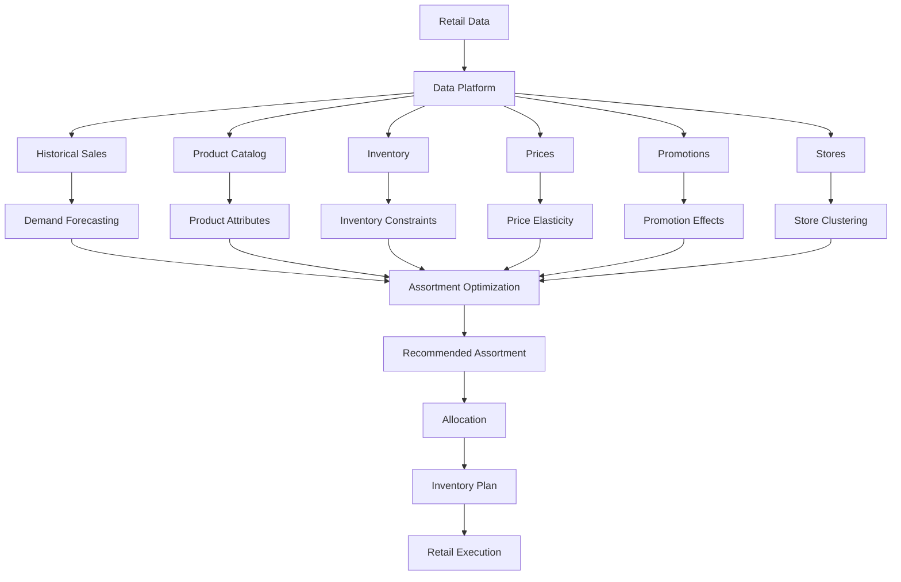
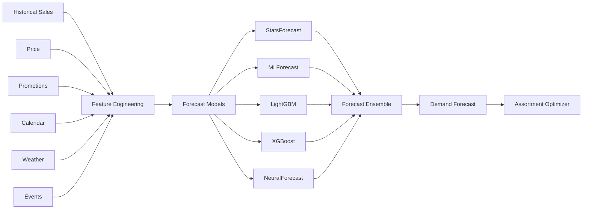

<p align="center">
  
</p>

<p align="center">
  <a href="https://github.com/ishandutta2007/Awesome-Awesome-Awesome"></a><a href="https://discord.gg/jc4xtF58Ve"></a>
  <a href="https://github.com/ishandutta2007/Awesome-Retail-Assortment-Planning/stargazers"></a>
  <a href="https://github.com/ishandutta2007/Awesome-Retail-Assortment-Planning/network/members"></a>
  <a href="https://github.com/ishandutta2007/Awesome-Retail-Assortment-Planning/blob/main/LICENSE"></a>
  <a href="https://github.com/ishandutta2007"></a>
</p>

# 🛍️ Top Retail Assortment Planning Platforms & Open-Source Software


> A curated list of **Retail Assortment Planning platforms, merchandise planning systems, demand forecasting tools, inventory optimization software, assortment optimization algorithms and open-source building blocks** for modern retail.


Retail assortment planning determines **which products should be offered, where they should be offered, in what quantities, for which selling periods, and at what price/margin targets**.


Modern assortment planning combines:


* Assortment optimization

* Demand forecasting

* Customer choice modeling

* Product clustering

* Localization

* Cannibalization analysis

* New-product forecasting

* Price elasticity

* Inventory optimization

* Allocation

* Space planning

* Markdown optimization

* Scenario planning

* Financial planning

* Promotion planning

* Supply-chain constraints


This repository focuses primarily on **open-source and self-hostable alternatives**, while maintaining a separate list of commercial platforms such as **o9 Solutions, RELEX Solutions, Blue Yonder, Oracle Retail, JustEnough, Aptos, Anaplan, Invent Analytics, Board and ToolsGroup**.


> **Important:** Unlike areas such as databases or web infrastructure, there is no single mature open-source project that completely replicates an enterprise retail assortment-planning suite. The strongest open-source approach is therefore **composable**: combine forecasting, optimization, choice modeling, inventory optimization, data infrastructure and retail applications.


A practical open-source assortment-planning stack can look like:


```text

                         RETAIL DATA

                              │

               ┌──────────────┼──────────────┐

               ▼              ▼              ▼

             Sales         Products        Inventory

               │              │              │

               └──────────────┼──────────────┘

                              ▼

                       Demand Forecasting

                              │

                              ▼

                       Customer Choice

                              │

                              ▼

                     Assortment Optimization

                              │

              ┌───────────────┼───────────────┐

              ▼               ▼               ▼

          Localization      Margin        Inventory

              │               │               │

              └───────────────┼───────────────┘

                              ▼

                       Final Assortment

```


---


## 📑 Table of Contents


* [☁️ SaaS/Hosted Platforms](#️-saashosted-platforms)

* [🌍 Open-Source](#-open-source)

* [🛒 Open-Source Retail Planning Platforms](#-open-source-retail-planning-platforms)

* [📈 Open-Source Demand Forecasting](#-open-source-demand-forecasting)

* [🎯 Open-Source Assortment Optimization](#-open-source-assortment-optimization)

* [🧠 Open-Source Customer Choice Models](#-open-source-customer-choice-models)

* [📦 Open-Source Inventory Optimization](#-open-source-inventory-optimization)

* [⚙️ Open-Source Mathematical Optimization](#️-open-source-mathematical-optimization)

* [💰 Open-Source Pricing & Revenue Optimization](#-open-source-pricing--revenue-optimization)

* [🏷️ Open-Source Retail & ERP Platforms](#️-open-source-retail--erp-platforms)

* [📊 Open-Source Retail Analytics](#-open-source-retail-analytics)

* [🧮 Open-Source Simulation](#-open-source-simulation)

* [🔮 Open-Source Time-Series Forecasting](#-open-source-time-series-forecasting)

* [🧩 Commercial Platform → Open-Source Equivalent](#-commercial-platform--open-source-equivalent)

* [🏗️ Retail Assortment Planning Architecture](#️-retail-assortment-planning-architecture)

* [🔄 Open-Source Assortment Optimization Architecture](#-open-source-assortment-optimization-architecture)

* [📈 Demand Forecasting Architecture](#-demand-forecasting-architecture)

* [🎯 Assortment Optimization Workflow](#-assortment-optimization-workflow)

* [⚖️ Commercial vs Open-Source](#️-commercial-vs-open-source)

* [🚀 Recommended Open-Source Stacks](#-recommended-open-source-stacks)

* [📊 Technology Comparison](#-technology-comparison)

* [🎯 Recommended Projects by Use Case](#-recommended-projects-by-use-case)

* [🏢 Building an o9 / RELEX Alternative](#-building-an-o9--relex-alternative)

* [🧱 Building an Open-Source Retail Planning Platform](#-building-an-open-source-retail-planning-platform)

* [🌐 Open-Source Retail Planning Landscape](#-open-source-retail-planning-landscape)

* [🧠 Why Open-Source Assortment Planning Matters](#-why-open-source-assortment-planning-matters)

* [🔍 SEO Key Topics & Retail Planning Taxonomy](#-seo-key-topics--retail-planning-taxonomy)

* [🤝 Contributing](#-contributing)

* [⭐ Star History](#-star-history)

* [⚠️ Disclaimer](#️-disclaimer)

---

# ☁️ SaaS/Hosted Platforms


Commercial retail planning platforms combine assortment, merchandise, demand, inventory and financial planning into integrated enterprise applications.

> 📊 **Sector Market Size & Structure:** The dedicated retail assortment and merchandise planning software market is estimated at **~$2.3B to $3.1B** globally (expanding at ~9%–15% CAGR within the broader ~$25B+ retail enterprise planning space). The sector is **moderately fragmented** rather than a winner-take-all monopoly, featuring legacy multi-suite ERP behemoths (Oracle, SAP, Manhattan Associates) competing alongside specialized high-growth AI-native planning engines (o9 Solutions, RELEX, Board, Invent Analytics).


| Platform | Company | Company Size (Valuation / Revenue) | Primary Focus | Key Capabilities | Starting Pricing | Free Tier / Trial Limits |
| :--- | :--- | :--- | :--- | :--- | :--- | :--- |
| [Oracle Retail](https://www.oracle.com/retail/) | Oracle | ~$464B Market Cap (~$57.4B FY25 Revenue) | Enterprise retail | Assortment, merchandise planning, allocation and inventory | Starting at ~$150/user/month (Hosted Named User license minimums; core modules scale from ~$30,000/year) | 30-day free trial via Oracle Cloud Infrastructure ($300 free cloud credits) + Oracle Always Free tier (2 AMD Compute VMs, 200 GB block storage, Autonomous Database) |
| [SAP](https://www.sap.com/industries/retail.html) | SAP | ~$250B+ Market Cap (~€36.8B / $42.4B FY25 Revenue) | Retail planning | Merchandise planning, demand, inventory and supply chain | Starting at ~$180/user/month (SAP S/4HANA Cloud Public Edition; minimum 15 users = ~$32,400/year) | 30-day SAP S/4HANA Cloud Public Edition free trial with predefined business scenarios & test data; SAP BTP Free Tier (lifetime free tier for select cloud platform developer services) |
| [Manhattan Associates](https://www.manh.com/) | Manhattan Associates | ~$13B Market Cap (~$1.08B FY25 Revenue) | Supply-chain / retail | Allocation, inventory, planning and fulfillment | Starting at ~$15,000/month (~$180,000/year entry Manhattan Active Omni/Planning tier) | No free tier; 30-day guided prototype / proof-of-concept sandbox upon qualification |
| [Anaplan](https://www.anaplan.com/solutions/assortment-planning/) | Anaplan | ~$10.4B Acquisition Valuation (~$600M ARR; acquired by Thoma Bravo) | Connected planning | Assortment, financial, merchandise and scenario planning | Starting at ~$30,000/year (~$2,500/month entry Basic/Standard tier) | No free tier; 14-day to 30-day guided sandbox environment during proof-of-concept evaluation |
| [Blue Yonder](https://blueyonder.com/) | Blue Yonder | ~$8.5B Enterprise Valuation (~$1.36B FY24 Revenue; Panasonic subsidiary) | Retail planning | Assortment, merchandise, demand, allocation and supply chain | Starting at ~$100,000/year (entry single-module SaaS tier) | No free tier; 30-day guided evaluation sandbox upon enterprise sales engagement |
| [RELEX Solutions](https://www.relexsolutions.com/) | RELEX Solutions | ~$5.7B Valuation (~$300M–$467M ARR/Revenue; Blackstone-backed) | Retail optimization | Assortment, demand, replenishment, allocation and pricing | Starting at ~€3,000/year (base single-module starter tier; core multi-store deployments scale from ~€50,000/year) | No free tier; 30-day custom pilot simulation upon qualification |
| [o9 Solutions](https://o9solutions.com/) | o9 Solutions | ~$3.7B Valuation (~$160M–$200M ARR; General Atlantic/KKR-backed) | Integrated retail planning | Assortment, merchandise, demand, supply and financial planning | Starting at ~$150,000/year (enterprise subscription tier) | No free tier; 30-day proof-of-concept / guided pilot sandbox upon qualification |
| [Board](https://www.board.com/) | Board International | ~$800M–$1B Est. Valuation (€155M / ~$170M Revenue; Nordic Capital-backed) | Enterprise planning | Retail planning, forecasting, analytics and scenario modeling | Starting at ~$1,500/user/year (~$125/user/month; entry license deployments start at ~$25,000/year) | No free tier; 14-day trial / sandbox environment upon sales qualification |
| [Aptos](https://www.aptos.com/) | Aptos | ~$500M–$800M Est. Valuation (~$82M+ Revenue; Goldman Sachs-backed) | Retail planning | Merchandise, assortment, allocation and planning | Starting at ~$250/store/month (~$3,000/store/year minimum commitment) | No free tier; 30-day structured proof-of-concept pilot with demo data upon qualification |
| [ToolsGroup](https://www.toolsgroup.com/) | ToolsGroup | ~$300M–$500M Est. Valuation (~$65M+ Revenue; Accel-KKR-backed) | Supply-chain optimization | Demand forecasting, inventory and assortment optimization | Starting at ~$3,500/month (~$42,000/year entry tier via "Pay-as-You-Grow" plan) | No free tier; 14-day guided proof-of-concept trial upon vendor qualification |
| [JustEnough](https://www.justenough.com/) | ToolsGroup / JustEnough | ~$300M–$500M Parent Valuation (~$100M division est.; subsidiary of ToolsGroup) | Merchandise planning | Assortment, inventory and merchandise optimization | Starting at ~$4,000/month (~$48,000/year entry retail planning tier) | No free tier; 14-day interactive guided evaluation sandbox upon sales demo |
| [Invent Analytics](https://inventanalytics.com/) | Invent Analytics | ~$100M–$150M Est. Valuation (~$36.3M Revenue; $24.5M funding raised) | Retail optimization | Inventory, assortment, pricing and demand optimization | Starting at ~$5,000/month (~$60,000/year entry AI inventory & assortment tier) | No free tier; 30-day pre-go-live algorithmic simulation & financial ROI benchmark test |
| [Nextail](https://nextail.co/) | Nextail | ~$30M–$50M Est. Valuation (~$17.7M ARR; $13.3M funding raised) | Retail merchandising | Assortment, allocation, pricing and merchandising optimization | Starting at ~€60,000/year (~€5,000/month entry tier for mid-market fashion networks) | No free tier; 30-day diagnostic pilot simulation using historical retailer data |


Anaplan's current assortment-planning application, for example, combines AI forecasting, localization, scenario planning, newness forecasting, complementarity and cannibalization analysis.


---


# 🌍 Open-Source


Open-source assortment planning is best viewed as a **technology stack rather than a single application**.


```text

                       OPEN-SOURCE RETAIL PLANNING

                                  │

          ┌───────────────────────┼───────────────────────┐

          │                       │                       │

          ▼                       ▼                       ▼

      Forecasting            Optimization             Retail ERP

          │                       │                       │

          ▼                       ▼                       ▼

     Nixtla / Darts          OR-Tools / Pyomo        ERPNext / Odoo

     GluonTS / MLForecast    OptaPlanner              OpenBoxes

          │                       │

          └───────────────┬───────┘

                          ▼

                  Assortment Engine

                          │

             ┌────────────┼────────────┐

             ▼            ▼            ▼

         Choice Model   Inventory    Pricing

             │         Optimization  Optimization

             └────────────┼────────────┘

                          ▼

                    Retail Planner

```


There are a few projects specifically implementing assortment optimization. For example, `hugopalmer/assortment_optimization` implements a data-driven assortment-optimization workflow involving choice-model learning and assortment optimization, while `IP_Assortment_CODE` implements an integer-programming approach to quick-commerce assortment planning.


---


# 🛒 Open-Source Retail Planning Platforms


There is no universally dominant open-source equivalent of **o9 / RELEX / Blue Yonder / Oracle Retail**. Instead, these projects provide different parts of the planning stack.


| Project | Primary Role | Relevance |
| :--- | :--- | :--- |
| [Odoo Community](https://github.com/odoo/odoo) [](https://github.com/odoo/odoo/stargazers) | ERP / Retail Suite | Product catalogs, inventory control, POS, multi-warehouse & replenishment workflows |
| [ERPNext](https://github.com/frappe/erpnext) [](https://github.com/frappe/erpnext/stargazers) | Open-Source ERP | Merchandise master data, purchasing, sales, inventory valuation & financial planning |
| [Medusa](https://github.com/medusajs/medusa) [](https://github.com/medusajs/medusa/stargazers) | Digital Commerce Infrastructure | Modular product catalog APIs, multi-region sales channels, inventory synchronization |
| [Bagisto](https://github.com/bagisto/bagisto) [](https://github.com/bagisto/bagisto/stargazers) | eCommerce & Retail Platform | Multi-inventory sourcing, product catalog management, localized pricing & point of sale |
| [Saleor](https://github.com/saleor/saleor) [](https://github.com/saleor/saleor/stargazers) | Headless Commerce Platform | Omnichannel product catalogs, dynamic pricing, multi-warehouse inventory allocation |
| [Spree Commerce](https://github.com/spree/spree) [](https://github.com/spree/spree/stargazers) | Commerce & Order Framework | Configurable merchandising catalogs, order lifecycle, stock location routing |
| [Vendure](https://github.com/vendure-ecommerce/vendure) [](https://github.com/vendure-ecommerce/vendure/stargazers) | Headless Retail Infrastructure | TypeScript commerce core, product variant hierarchies, multi-channel stock levels |
| [Dolibarr](https://github.com/Dolibarr/dolibarr) [](https://github.com/Dolibarr/dolibarr/stargazers) | ERP / CRM / Retail Suite | Product categorizations, stock movements, order fulfillment & procurement workflows |
| [Solidus](https://github.com/solidusio/solidus) [](https://github.com/solidusio/solidus/stargazers) | Custom Commerce Engine | Flexible inventory tracking, pricing calculation engines & promotion management |
| [Apache OFBiz](https://github.com/apache/ofbiz-framework) [](https://github.com/apache/ofbiz-framework/stargazers) | Enterprise ERP / Commerce | Enterprise product information, order fulfillment & advanced supply-chain planning |
| [OpenBoxes](https://github.com/openboxes/openboxes) [](https://github.com/openboxes/openboxes/stargazers) | Inventory & SCM Operations | Supply-chain inventory tracking, stock movements, bin locations & warehouse replenishment |


OpenBoxes is a particularly useful open-source supply-chain building block because it provides inventory and stock-movement management and is explicitly designed as a general-purpose warehouse/supply-chain system.


---


# 📈 Open-Source Demand Forecasting


Demand forecasting is one of the most important inputs to assortment planning.


```text

Historical Sales

      │

      ▼

Seasonality ──────┐

Promotions ───────┤

Price ────────────┤

Weather ──────────┤

Events ───────────┤

Store ────────────┤

Product ──────────┤

Competitors ──────┘

      │

      ▼

Demand Forecast

      │

      ▼

Assortment Optimization

```


| Project | Description |
| :--- | :--- |
| [XGBoost](https://github.com/dmlc/xgboost) [](https://github.com/dmlc/xgboost/stargazers) | Industry-standard gradient boosting for tabular demand forecasting with promotional & calendar features |
| [Prophet](https://github.com/facebook/prophet) [](https://github.com/facebook/prophet/stargazers) | Robust Bayesian decomposable time-series forecasting handling multi-period seasonality, holidays & changepoints |
| [LightGBM](https://github.com/microsoft/LightGBM) [](https://github.com/microsoft/LightGBM/stargazers) | High-speed, memory-efficient gradient boosting for large-scale SKU-level demand prediction |
| [Time-Series-Library (TSlib)](https://github.com/thuml/Time-Series-Library) [](https://github.com/thuml/Time-Series-Library/stargazers) | Comprehensive deep learning benchmark library including PatchTST, TimesNet, DLinear & Informer |
| [Statsmodels](https://github.com/statsmodels/statsmodels) [](https://github.com/statsmodels/statsmodels/stargazers) | Rigorous statistical time-series modeling (ARIMA, SARIMAX, Exponential Smoothing, VAR) for econometric analysis |
| [AutoGluon-TimeSeries](https://github.com/autogluon/autogluon) [](https://github.com/autogluon/autogluon/stargazers) | Automated probabilistic time-series forecasting ensembling statistical, machine learning & neural models |
| [sktime](https://github.com/sktime/sktime) [](https://github.com/sktime/sktime/stargazers) | Unified scikit-learn compatible framework for time-series forecasting, transformation and model evaluation |
| [Darts](https://github.com/unit8co/darts) [](https://github.com/unit8co/darts/stargazers) | User-friendly time-series forecasting library unifying ARIMA, Prophet, XGBoost, TiDE, TFT and N-BEATS |
| [CatBoost](https://github.com/catboost/catboost) [](https://github.com/catboost/catboost/stargazers) | High-performance gradient boosting with superior native categorical feature handling for retail attributes |
| [Kats](https://github.com/facebookresearch/Kats) [](https://github.com/facebookresearch/Kats/stargazers) | Meta toolkit for time-series analysis, automated feature extraction, trend detection and outlier removal |
| [Chronos Forecasting](https://github.com/amazon-science/chronos-forecasting) [](https://github.com/amazon-science/chronos-forecasting/stargazers) | Pretrained time-series foundation models based on language model architectures by Amazon Research |
| [GluonTS](https://github.com/awslabs/gluonts) [](https://github.com/awslabs/gluonts/stargazers) | Deep learning probabilistic time-series framework developed by AWS for probabilistic replenishment demand |
| [PyTorch Forecasting](https://github.com/jdb78/pytorch-forecasting) [](https://github.com/jdb78/pytorch-forecasting/stargazers) | Deep learning time-series architectures including Temporal Fusion Transformers (TFT) with interpretability |
| [StatsForecast](https://github.com/Nixtla/statsforecast) [](https://github.com/Nixtla/statsforecast/stargazers) | Lightning-fast statistical forecasting (AutoARIMA, ETS, CES, Theta) optimized in C/Numba for massive SKU catalogs |
| [Merlion](https://github.com/salesforce/Merlion) [](https://github.com/salesforce/Merlion/stargazers) | Salesforce time-series library offering automated model selection, ensembles, anomaly detection & evaluation |
| [NeuralForecast](https://github.com/Nixtla/neuralforecast) [](https://github.com/Nixtla/neuralforecast/stargazers) | Scalable neural forecasting models (NHITS, NBEATS, TFT, TimesNet) designed for large enterprise time-series |
| [Orbit](https://github.com/uber/orbit) [](https://github.com/uber/orbit/stargazers) | Uber Bayesian time-series forecasting framework utilizing Stan/Pyro for marketing mix & demand estimation |
| [Greykite](https://github.com/linkedin/greykite) [](https://github.com/linkedin/greykite/stargazers) | LinkedIn flagship time-series forecasting library powering Silverkite with automated anomaly and trend modeling |
| [MLForecast](https://github.com/Nixtla/mlforecast) [](https://github.com/Nixtla/mlforecast/stargazers) | Scalable feature engineering and recursive forecasting framework for LightGBM, XGBoost, CatBoost & scikit-learn |


A practical assortment planner can combine:


```text

StatsForecast

      +

MLForecast

      +

LightGBM / XGBoost

      +

Deep Forecasting

      =

Demand Forecast Ensemble

```


---


# 🎯 Open-Source Assortment Optimization


This is the most specialized part of the ecosystem.


| Project | Approach | Focus |
| :--- | :--- | :--- |
| [Google OR-Tools](https://github.com/google/or-tools) [](https://github.com/google/or-tools/stargazers) | Operations Research / CP-SAT / MILP | Fast industrial solver for store capacity, shelf-space allocation and complex assortment rules |
| [CVXPY](https://github.com/cvxpy/cvxpy) [](https://github.com/cvxpy/cvxpy/stargazers) | Convex & Mixed-Integer Optimization | Domain-specific modeling language for margin optimization and convex portfolio formulations |
| [OptaPlanner](https://github.com/apache/incubator-kie-optaplanner) [](https://github.com/apache/incubator-kie-optaplanner/stargazers) | Constraint Satisfaction & Metaheuristics | AI constraint solver for retail scheduling, shelf allocation and score-driven assortment selection |
| [Pyomo](https://github.com/Pyomo/pyomo) [](https://github.com/Pyomo/pyomo/stargazers) | Algebraic Modeling Language (Python) | Formulation of complex non-linear choice models, supply constraints and assortment integer programs |
| [PuLP](https://github.com/coin-or/pulp) [](https://github.com/coin-or/pulp/stargazers) | Linear & Integer Programming (Python) | Intuitive modeling interface connecting to CBC, GLPK, HiGHS and commercial solvers for assortment MILP |
| [JuMP](https://github.com/jump-dev/JuMP.jl) [](https://github.com/jump-dev/JuMP.jl/stargazers) | High-Performance Mathematical Programming | Blazing-fast mathematical modeling in Julia for massive retail portfolio and assortment optimization |
| [HiGHS](https://github.com/ERGO-Code/HiGHS) [](https://github.com/ERGO-Code/HiGHS/stargazers) | Modern High-Performance LP/MIP Solver | Leading open-source linear/integer solver powering SciPy for large-scale category selection |
| [Timefold Solver](https://github.com/TimefoldAI/timefold-solver) [](https://github.com/TimefoldAI/timefold-solver/stargazers) | AI Constraint Optimization Platform | Active modern fork of OptaPlanner solving multi-constraint retail assortment & planogram problems |
| [MiniZinc](https://github.com/MiniZinc/libminizinc) [](https://github.com/MiniZinc/libminizinc/stargazers) | Constraint Modeling Language | Expressive constraint satisfaction modeling for complex discrete category rules and space allocation |
| [SCIP](https://github.com/scipopt/scip) [](https://github.com/scipopt/scip/stargazers) | MIP & Non-Linear Constraint Solver | State-of-the-art non-commercial solver for non-linear assortment choice models and MINLP formulations |
| [python-mip](https://github.com/coin-or/python-mip) [](https://github.com/coin-or/python-mip/stargazers) | High-Level Mixed-Integer Modeling | Fast C-interfaced Python package for building and executing fast integer assortment models |
| [assortment_optimization](https://github.com/hugopalmer/assortment_optimization) [](https://github.com/hugopalmer/assortment_optimization/stargazers) | Choice Modeling + Assortment Optimization | End-to-end Python implementation: choice-model estimation → generalization → optimal assortment selection |
| [IP_Assortment_CODE](https://github.com/YLW2018/IP_Assortment_CODE) [](https://github.com/YLW2018/IP_Assortment_CODE/stargazers) | Integer Programming Formulation | Mathematical programming formulation specifically targeting quick-commerce assortment and dark store limits |


The `assortment_optimization` project is especially relevant because it explicitly implements the sequence **choice-model learning → generalization → assortment optimization**, rather than merely providing generic inventory optimization.


---


# 🧠 Open-Source Customer Choice Models


Assortment optimization is fundamentally related to **customer choice modeling**.


A simplified formulation is:


```text

                    CUSTOMER

                       │

                       ▼

                Available Products

                       │

           ┌───────────┼───────────┐

           ▼           ▼           ▼

        Product A   Product B   Product C

           │           │           │

           └───────────┼───────────┘

                       ▼

                  Choice Model

                       │

                       ▼

              Purchase Probability

                       │

                       ▼

              Assortment Optimization

```


Common open-source building blocks include:


| Project / Library | Use |
| :--- | :--- |
| [scikit-learn](https://github.com/scikit-learn/scikit-learn) [](https://github.com/scikit-learn/scikit-learn/stargazers) | Multinomial logistic regression, classification baselines, customer segmentation and propensity modeling |
| [Statsmodels](https://github.com/statsmodels/statsmodels) [](https://github.com/statsmodels/statsmodels/stargazers) | Statistical Multinomial Logit (MNL), conditional logit, odds-ratio diagnostics and hypothesis testing |
| [PyMC](https://github.com/pymc-devs/pymc) [](https://github.com/pymc-devs/pymc/stargazers) | Bayesian choice modeling, Random-Coefficient Logit, latent-class models and demand uncertainty quantification |
| [Pyro](https://github.com/pyro-ppl/pyro) [](https://github.com/pyro-ppl/pyro/stargazers) | Deep probabilistic programming (PyTorch-backed) for large-scale Bayesian discrete choice modeling |
| [hubbs5/or-gym](https://github.com/hubbs5/or-gym) [](https://github.com/hubbs5/or-gym/stargazers) | Reinforcement learning environments for dynamic inventory, supply-chain control and customer choice reactions |
| [PyLogit](https://github.com/timothyb0912/pylogit) [](https://github.com/timothyb0912/pylogit/stargazers) | Dedicated Python package for Multinomial Logit, Nested Logit, Mixed Logit and panel choice data |
| [CmdStanPy](https://github.com/stan-dev/cmdstanpy) [](https://github.com/stan-dev/cmdstanpy/stargazers) | Fast Python interface to Stan for state-of-the-art MCMC sampling of hierarchical discrete choice models |
| [Biogeme](https://github.com/michelbierlaire/biogeme) [](https://github.com/michelbierlaire/biogeme/stargazers) | Widely published discrete choice estimation engine supporting GEV, Nested Logit, Probit & latent models |
| [Choice-Learn](https://github.com/artefactory/choice-learn) [](https://github.com/artefactory/choice-learn/stargazers) | Modern Python library for industrial-scale discrete choice modeling using statistical & deep learning techniques |
| [ChoiceModels](https://github.com/UDST/choicemodels) [](https://github.com/UDST/choicemodels/stargazers) | Urban Data Science toolkit for multinomial logit simulation, choice probabilities and sampling of alternatives |
| [assortment_optimization](https://github.com/hugopalmer/assortment_optimization) [](https://github.com/hugopalmer/assortment_optimization/stargazers) | Data-driven assortment optimization pipeline incorporating customer substitution and choice estimation |
| [Larch](https://github.com/driftlesslabs/larch) [](https://github.com/driftlesslabs/larch/stargazers) | High-speed Python/Numba tool for estimating and predicting logit-based discrete choice architectures |


Typical models include:


* Multinomial Logit

* Nested Logit

* Mixed Logit

* Multinomial Probit

* Latent-class models

* Random-coefficient models

* Machine-learning choice models


---


# 📦 Open-Source Inventory Optimization


Assortment decisions cannot be separated from inventory availability.


| Project | Focus |
| :--- | :--- |
| [Odoo Community](https://github.com/odoo/odoo) [](https://github.com/odoo/odoo/stargazers) | Automated reordering rules, multi-warehouse stock routing, min/max safety stock and vendor lead times |
| [ERPNext](https://github.com/frappe/erpnext) [](https://github.com/frappe/erpnext/stargazers) | Inventory valuation (FIFO/Moving Average), automated purchase replenishment, batch/serial tracking |
| [Google OR-Tools](https://github.com/google/or-tools) [](https://github.com/google/or-tools/stargazers) | Multi-echelon inventory allocation, vehicle routing, warehouse capacity and distribution optimization |
| [Pyomo](https://github.com/Pyomo/pyomo) [](https://github.com/Pyomo/pyomo/stargazers) | Mathematical modeling of multi-period stochastic inventory policies, safety stock & service-level constraints |
| [OpenBoxes](https://github.com/openboxes/openboxes) [](https://github.com/openboxes/openboxes/stargazers) | Warehouse management, inventory tracking, stock movements, expiration control and multi-facility visibility |
| [OR-Gym](https://github.com/hubbs5/or-gym) [](https://github.com/hubbs5/or-gym/stargazers) | Gym environments for reinforcement learning applied to multi-echelon inventory and lost-sales problems |
| [supplychainpy](https://github.com/KevinFasusi/supplychainpy) [](https://github.com/KevinFasusi/supplychainpy/stargazers) | Python library for supply-chain analytics, EOQ, safety stock calculation, SKU ABC/XYZ classification |
| [Stockpyl](https://github.com/LarrySnyder/stockpyl) [](https://github.com/LarrySnyder/stockpyl/stargazers) | Comprehensive inventory models: multi-echelon inventory theory, (s, S) policies, safety stock optimization |
| [Forecast-Driven Inventory Control](https://github.com/PhongNguyen97/Forecast-Driven-Inventory-Control-Analytics) [](https://github.com/PhongNguyen97/Forecast-Driven-Inventory-Control-Analytics/stargazers) | End-to-end framework integrating time-series demand forecasting with continuous-review inventory replenishment |
| [RetailOps](https://github.com/MarieGutiz/RetailOps) [](https://github.com/MarieGutiz/RetailOps/stargazers) | Discrete-event retail inventory simulation modeling store stockouts, restocking frequencies and service levels |
| [Retail Forecasting & Inventory](https://github.com/Tufan2416/Retail-Sales-Forecasting-Inventory-Optimization) [](https://github.com/Tufan2416/Retail-Sales-Forecasting-Inventory-Optimization/stargazers) | Applied pipeline combining demand forecasting algorithms with Economic Order Quantity (EOQ) optimization |


Open-source retail projects increasingly combine forecasting with operational inventory decisions such as EOQ, reorder points and safety stock.


---


# ⚙️ Open-Source Mathematical Optimization


A serious assortment optimizer frequently becomes a **mixed-integer optimization problem**.


```text

Maximize:


Revenue

+ Margin

+ Customer Satisfaction

- Inventory Cost

- Markdown Cost

- Assortment Complexity

- Cannibalization


Subject to:


Store Capacity

Product Availability

Budget

Shelf Space

Supplier Constraints

Minimum Assortment Size

Maximum Assortment Size

Category Constraints

Brand Constraints

Inventory

Lead Times

```


| Framework | LP | MILP | CP | Nonlinear | Primary Language |
| :--- | :--- | :--- | :--- | :--- | :--- |
| [OR-Tools](https://github.com/google/or-tools) [](https://github.com/google/or-tools/stargazers) | ✅ | ✅ | ✅ | ⚠️ | C++ / Python / Java / .NET |
| [CVXPY](https://github.com/cvxpy/cvxpy) [](https://github.com/cvxpy/cvxpy/stargazers) | ✅ | ⚠️ | ❌ | ✅ | Python |
| [OptaPlanner](https://github.com/apache/incubator-kie-optaplanner) [](https://github.com/apache/incubator-kie-optaplanner/stargazers) | ⚠️ | ⚠️ | ✅ | ⚠️ | Java |
| [Pyomo](https://github.com/Pyomo/pyomo) [](https://github.com/Pyomo/pyomo/stargazers) | ✅ | ✅ | ✅ | ✅ | Python |
| [PuLP](https://github.com/coin-or/pulp) [](https://github.com/coin-or/pulp/stargazers) | ✅ | ✅ | ❌ | ❌ | Python |
| [JuMP](https://github.com/jump-dev/JuMP.jl) [](https://github.com/jump-dev/JuMP.jl/stargazers) | ✅ | ✅ | ✅ | ✅ | Julia |
| [CasADi](https://github.com/casadi/casadi) [](https://github.com/casadi/casadi/stargazers) | ✅ | ❌ | ❌ | ✅ | C++ / Python / MATLAB |
| [HiGHS](https://github.com/ERGO-Code/HiGHS) [](https://github.com/ERGO-Code/HiGHS/stargazers) | ✅ | ✅ | ❌ | ⚠️ | C++ |
| [Timefold Solver](https://github.com/TimefoldAI/timefold-solver) [](https://github.com/TimefoldAI/timefold-solver/stargazers) | ⚠️ | ⚠️ | ✅ | ⚠️ | Java / Kotlin / Python |
| [Cbc](https://github.com/coin-or/Cbc) [](https://github.com/coin-or/Cbc/stargazers) | ✅ | ✅ | ❌ | ❌ | C++ |
| [SCIP](https://github.com/scipopt/scip) [](https://github.com/scipopt/scip/stargazers) | ✅ | ✅ | ✅ | ✅ | C / C++ |
| [python-mip](https://github.com/coin-or/python-mip) [](https://github.com/coin-or/python-mip/stargazers) | ✅ | ✅ | ❌ | ❌ | Python |


---


# 💰 Open-Source Pricing & Revenue Optimization


Pricing and assortment are closely connected.


A retailer may want to maximize:


```text

Total Profit

    =

Sales Revenue

    -

Product Cost

    -

Inventory Cost

    -

Markdown Cost

```


Useful open-source components:


| Project | Role |
| :--- | :--- |
| [scikit-learn](https://github.com/scikit-learn/scikit-learn) [](https://github.com/scikit-learn/scikit-learn/stargazers) | Baseline price elasticity estimation, customer demand modeling & feature selection |
| [XGBoost](https://github.com/dmlc/xgboost) [](https://github.com/dmlc/xgboost/stargazers) | Price-demand response prediction, promotional lift modeling & markdown impact analysis |
| [LightGBM](https://github.com/microsoft/LightGBM) [](https://github.com/microsoft/LightGBM/stargazers) | Fast gradient boosting for SKU-level price sensitivity, willingness-to-pay and markdown models |
| [OR-Tools](https://github.com/google/or-tools) [](https://github.com/google/or-tools/stargazers) | Constraint-based dynamic pricing optimization, markdown timing schedules and revenue maximization |
| [PyMC](https://github.com/pymc-devs/pymc) [](https://github.com/pymc-devs/pymc/stargazers) | Bayesian hierarchical price elasticity models capturing store-level, category-level and seasonal variations |
| [DoWhy](https://github.com/py-why/dowhy) [](https://github.com/py-why/dowhy/stargazers) | Causal inference framework for validating real price elasticity vs confounded historical correlation |
| [CVXPY](https://github.com/cvxpy/cvxpy) [](https://github.com/cvxpy/cvxpy/stargazers) | Mathematical optimization for quadratic and convex revenue management formulations |
| [CausalML](https://github.com/uber/causalml) [](https://github.com/uber/causalml/stargazers) | Uplift modeling and heterogeneous treatment effect estimation for retail promotions and discounts |
| [EconML](https://github.com/py-why/EconML) [](https://github.com/py-why/EconML/stargazers) | Econometric machine learning (Double/Debiased ML) for estimating causal price elasticity & pricing policies |
| [Pyomo](https://github.com/Pyomo/pyomo) [](https://github.com/Pyomo/pyomo/stargazers) | Formulation of joint assortment-pricing non-linear optimization models and margin targets |


---


# 🏷️ Open-Source Retail & ERP Platforms


These projects are not dedicated assortment-planning products, but they provide important retail data and operational layers.


| Project | Capabilities |
| :--- | :--- |
| [Odoo Community](https://github.com/odoo/odoo) [](https://github.com/odoo/odoo/stargazers) | Product catalogs, inventory control, POS, multi-warehouse & replenishment workflows |
| [ERPNext](https://github.com/frappe/erpnext) [](https://github.com/frappe/erpnext/stargazers) | Merchandise master data, purchasing, sales, inventory valuation & financial planning |
| [Medusa](https://github.com/medusajs/medusa) [](https://github.com/medusajs/medusa/stargazers) | Modular product catalog APIs, multi-region sales channels, inventory synchronization |
| [Bagisto](https://github.com/bagisto/bagisto) [](https://github.com/bagisto/bagisto/stargazers) | Multi-inventory sourcing, product catalog management, localized pricing & point of sale |
| [Saleor](https://github.com/saleor/saleor) [](https://github.com/saleor/saleor/stargazers) | Omnichannel product catalogs, dynamic pricing, multi-warehouse inventory allocation |
| [Spree Commerce](https://github.com/spree/spree) [](https://github.com/spree/spree/stargazers) | Configurable merchandising catalogs, order lifecycle, stock location routing |
| [Vendure](https://github.com/vendure-ecommerce/vendure) [](https://github.com/vendure-ecommerce/vendure/stargazers) | TypeScript commerce core, product variant hierarchies, multi-channel stock levels |
| [Dolibarr](https://github.com/Dolibarr/dolibarr) [](https://github.com/Dolibarr/dolibarr/stargazers) | Product categorizations, stock movements, order fulfillment & procurement workflows |
| [Solidus](https://github.com/solidusio/solidus) [](https://github.com/solidusio/solidus/stargazers) | Flexible inventory tracking, pricing calculation engines & promotion management |
| [Apache OFBiz](https://github.com/apache/ofbiz-framework) [](https://github.com/apache/ofbiz-framework/stargazers) | Enterprise product information, order fulfillment & advanced supply-chain planning |
| [OpenBoxes](https://github.com/openboxes/openboxes) [](https://github.com/openboxes/openboxes/stargazers) | Supply-chain inventory tracking, stock movements, bin locations & warehouse replenishment |


---


# 📊 Open-Source Retail Analytics


Assortment planning requires a large analytics layer.


| Project | Role |
| :--- | :--- |
| [Grafana](https://github.com/grafana/grafana) [](https://github.com/grafana/grafana/stargazers) | Real-time operational dashboards for store sales, out-of-stock monitoring & inventory velocity |
| [Apache Superset](https://github.com/apache/superset) [](https://github.com/apache/superset/stargazers) | Enterprise BI, category performance exploration, margin analytics & merchandise KPI dashboards |
| [Pandas](https://github.com/pandas-dev/pandas) [](https://github.com/pandas-dev/pandas/stargazers) | Core tabular data processing, category hierarchy aggregations and sales time-series transformation |
| [Metabase](https://github.com/metabase/metabase) [](https://github.com/metabase/metabase/stargazers) | Self-service analytics and intuitive visual querying for retail merchants and planning teams |
| [Apache Airflow](https://github.com/apache/airflow) [](https://github.com/apache/airflow/stargazers) | Data orchestration for daily demand forecasting pipelines, inventory ETL and model inference jobs |
| [Apache Spark](https://github.com/apache/spark) [](https://github.com/apache/spark/stargazers) | Distributed data processing for massive multi-store transactional logs and POS receipt datasets |
| [DuckDB](https://github.com/duckdb/duckdb) [](https://github.com/duckdb/duckdb/stargazers) | High-speed in-process analytical SQL database for instant querying of parquet retail datasets |
| [Polars](https://github.com/pola-rs/polars) [](https://github.com/pola-rs/polars/stargazers) | Lightning-fast multithreaded DataFrame library for processing millions of store-SKU combinations |
| [Cube](https://github.com/cube-js/cube) [](https://github.com/cube-js/cube/stargazers) | Universal semantic layer providing standardized retail metrics (GMV, sell-through, turns, GMROI) |
| [dbt Core](https://github.com/dbt-labs/dbt-core) [](https://github.com/dbt-labs/dbt-core/stargazers) | Data transformation framework for structuring retail dimension models, sales data marts and fact tables |
| [Evidence](https://github.com/evidence-dev/evidence) [](https://github.com/evidence-dev/evidence/stargazers) | Code-driven markdown reports and interactive data applications for merchandise planning presentations |


---


# 🧮 Open-Source Simulation


Simulation is useful for testing assortment decisions before deploying them.


```text

                    ASSORTMENT

                         │

                         ▼

                  Demand Model

                         │

                         ▼

                  Monte Carlo

                         │

              ┌──────────┼──────────┐

              ▼          ▼          ▼

           Demand A   Demand B   Demand C

              │          │          │

              └──────────┼──────────┘

                         ▼

                    Inventory

                         │

                         ▼

                   Service Level

                         │

                         ▼

                   Profit / Cost

```


| Project | Role |
| :--- | :--- |
| [NumPy](https://github.com/numpy/numpy) [](https://github.com/numpy/numpy/stargazers) | Vectorized Monte Carlo simulations of stochastic customer demand and lead time variations |
| [SciPy](https://github.com/scipy/scipy) [](https://github.com/scipy/scipy/stargazers) | Statistical distributions, probability modeling, curve fitting and numerical optimization algorithms |
| [PyMC](https://github.com/pymc-devs/pymc) [](https://github.com/pymc-devs/pymc/stargazers) | Bayesian posterior simulation of demand distributions, stockout uncertainty and supply risks |
| [Pyro](https://github.com/pyro-ppl/pyro) [](https://github.com/pyro-ppl/pyro/stargazers) | Deep probabilistic simulation and stochastic variational inference for complex retail networks |
| [Stockpyl](https://github.com/LarrySnyder/stockpyl) [](https://github.com/LarrySnyder/stockpyl/stargazers) | Exact and heuristic simulation of multi-echelon inventory policies, reorder triggers and safety stock |
| [RetailOps](https://github.com/MarieGutiz/RetailOps) [](https://github.com/MarieGutiz/RetailOps/stargazers) | Retail inventory and replenishment simulation modeling store-level stockouts and delivery delays |


---


# 🔮 Open-Source Time-Series Forecasting


A modern assortment planner may forecast demand at several levels:


```text

Company

   │

   ├── Region

   │     ├── Store

   │     │     ├── Category

   │     │     │     ├── Product

   │     │     │     │     └── SKU

   │     │     │

   │     │     └── Channel

   │     │

   │     └── Cluster

   │

   └── Online

```


Recommended tools:


| Tool | Best Use |
| :--- | :--- |
| [XGBoost](https://github.com/dmlc/xgboost) [](https://github.com/dmlc/xgboost/stargazers) | Tabular feature-engineered demand forecasting with rich calendar, price & promotional variables |
| [Prophet](https://github.com/facebook/prophet) [](https://github.com/facebook/prophet/stargazers) | Interpretable business forecasting with holiday calendars, seasonal cycles & manual trend breakpoints |
| [LightGBM](https://github.com/microsoft/LightGBM) [](https://github.com/microsoft/LightGBM/stargazers) | High-throughput tree boosting across millions of historical retail transaction time-series |
| [Time-Series-Library (TSlib)](https://github.com/thuml/Time-Series-Library) [](https://github.com/thuml/Time-Series-Library/stargazers) | State-of-the-art deep forecasting architectures (PatchTST, TimesNet, DLinear, Crossformer) |
| [AutoGluon-TimeSeries](https://github.com/autogluon/autogluon) [](https://github.com/autogluon/autogluon/stargazers) | Automated AutoML pipeline producing ensembled point & probabilistic forecasts with zero manual tuning |
| [sktime](https://github.com/sktime/sktime) [](https://github.com/sktime/sktime/stargazers) | Comprehensive algorithmic experimentation, reduction strategies, backtesting & pipeline composability |
| [Darts](https://github.com/unit8co/darts) [](https://github.com/unit8co/darts/stargazers) | Unified time-series experimentation across statistical, machine learning and neural architectures |
| [CatBoost](https://github.com/catboost/catboost) [](https://github.com/catboost/catboost/stargazers) | High accuracy on categorical product hierarchies, department taxonomies and store attributes |
| [Chronos Forecasting](https://github.com/amazon-science/chronos-forecasting) [](https://github.com/amazon-science/chronos-forecasting/stargazers) | Zero-shot foundation model forecasting for new product introductions (cold-start forecasting) |
| [GluonTS](https://github.com/awslabs/gluonts) [](https://github.com/awslabs/gluonts/stargazers) | Probabilistic demand forecasting generating prediction intervals essential for safety stock sizing |
| [PyTorch Forecasting](https://github.com/jdb78/pytorch-forecasting) [](https://github.com/jdb78/pytorch-forecasting/stargazers) | Deep neural forecasting with Temporal Fusion Transformers to inspect attention weights and variable importance |
| [StatsForecast](https://github.com/Nixtla/statsforecast) [](https://github.com/Nixtla/statsforecast/stargazers) | Ultra-fast statistical baselines (AutoARIMA, AutoETS, Croston) scaling to hundreds of thousands of series |
| [NeuralForecast](https://github.com/Nixtla/neuralforecast) [](https://github.com/Nixtla/neuralforecast/stargazers) | Fast GPU-accelerated deep neural architectures (NHITS, NBEATSx) with exogenous regressors |
| [MLForecast](https://github.com/Nixtla/mlforecast) [](https://github.com/Nixtla/mlforecast/stargazers) | Scalable recursive multi-step forecasting with distributed LightGBM / XGBoost over Spark or Dask |


---


# 🧩 Commercial Platform → Open-Source Equivalent


| Commercial Platform                   | Open-Source Equivalent / Building Blocks                                 |

| ------------------------------------- | ------------------------------------------------------------------------ |

| **o9 Solutions**                      | Forecasting + OR-Tools/Pyomo + ERPNext + optimization engine + BI        |

| **RELEX Solutions**                   | StatsForecast/MLForecast + OR-Tools + inventory optimization + OpenBoxes |

| **Blue Yonder**                       | Forecasting + Pyomo/OR-Tools + ERPNext + optimization models             |

| **Oracle Retail Assortment Planning** | ERPNext/Odoo + choice modeling + Pyomo + forecasting                     |

| **JustEnough**                        | Forecasting + assortment optimization + inventory optimization           |

| **Aptos Merchandise Planning**        | ERPNext + forecasting + optimization + BI                                |

| **Anaplan Retail**                    | Custom planning application + Pyomo/OR-Tools + forecasting + Superset    |

| **Invent Analytics**                  | Forecasting + optimization + ML + OR-Tools/Pyomo                         |

| **Board Retail**                      | Superset/Metabase + forecasting + optimization + planning application    |

| **ToolsGroup**                        | Forecasting + inventory optimization + OR-Tools + simulation             |

| **Nextail**                           | Forecasting + assortment optimization + pricing + allocation             |

| **Enterprise Assortment Planner**     | Choice Model + Forecasting + MILP + Inventory Optimizer                  |

| **Retail Planning Platform**          | ERPNext + Forecasting + Pyomo + Superset                                 |

| **Assortment Optimization API**       | FastAPI + Choice Model + OR-Tools/Pyomo                                  |

| **Retail AI Planning Platform**       | MLForecast + XGBoost + Pyomo + PostgreSQL + FastAPI                      |


---


# 🏗️ Retail Assortment Planning Architecture





---


# 🔄 Open-Source Assortment Optimization Architecture


```text

                         DATA SOURCES

                              │

       ┌──────────────────────┼──────────────────────┐

       ▼                      ▼                      ▼

     SALES                 PRODUCT                STORE

       │                      │                      │

       └──────────────────────┼──────────────────────┘

                              ▼

                        DATA PLATFORM

                              │

             ┌────────────────┼────────────────┐

             ▼                ▼                ▼

          Forecasting    Choice Modeling    Clustering

             │                │                │

             └────────────────┼────────────────┘

                              ▼

                    ASSORTMENT OPTIMIZER

                              │

                     OR-Tools / Pyomo

                              │

             ┌────────────────┼────────────────┐

             ▼                ▼                ▼

          Revenue           Margin          Inventory

                              │

                              ▼

                     FINAL ASSORTMENT

                              │

                              ▼

                         ALLOCATION

```


---


# 📈 Demand Forecasting Architecture





---


# 🎯 Assortment Optimization Workflow


```text

1. Collect historical sales

        │

        ▼

2. Clean product/store data

        │

        ▼

3. Forecast demand

        │

        ▼

4. Estimate customer choice

        │

        ▼

5. Identify product relationships

        │

        ├── Substitution

        ├── Complementarity

        └── Cannibalization

        │

        ▼

6. Cluster stores/customers

        │

        ▼

7. Define business constraints

        │

        ├── Budget

        ├── Shelf space

        ├── Inventory

        ├── Supplier

        ├── Category

        └── Brand

        │

        ▼

8. Run optimization

        │

        ▼

9. Evaluate scenarios

        │

        ▼

10. Select final assortment

        │

        ▼

11. Allocate inventory

```


---


# 🧠 Product Cannibalization


One of the most important problems in assortment planning is that adding another product can reduce sales of existing products.


```text

             Existing Assortment


       Product A       Product B

           │               │

           └───────┬───────┘

                   │

              New Product C

                   │

                   ▼

            Customer Choice

                   │

          ┌────────┼────────┐

          ▼        ▼        ▼

          A        B        C

        Sales ↓  Sales ↓  Sales ↑

```


A sophisticated optimizer should therefore maximize **incremental category value**, rather than simply selecting products with the highest standalone forecast.


---


# 🏪 Store Localization


A national assortment is rarely optimal for every store.


```text

                       NATIONAL

                      ASSORTMENT

                           │

          ┌────────────────┼────────────────┐

          ▼                ▼                ▼

       Urban            Suburban           Rural

          │                │                │

          ▼                ▼                ▼

      Assortment A     Assortment B     Assortment C

```


Open-source clustering tools can support this layer:


| Project | Role |
| :--- | :--- |
| [scikit-learn](https://github.com/scikit-learn/scikit-learn) [](https://github.com/scikit-learn/scikit-learn/stargazers) | K-Means, Agglomerative Hierarchical Clustering, PCA, t-SNE & Gaussian Mixture Models |
| [Pandas](https://github.com/pandas-dev/pandas) [](https://github.com/pandas-dev/pandas/stargazers) | Store feature engineering, store-level sales velocity aggregation and demographic indexing |
| [Polars](https://github.com/pola-rs/polars) [](https://github.com/pola-rs/polars/stargazers) | Ultra-fast feature extraction across hundreds of stores and tens of thousands of product lines |
| [XGBoost](https://github.com/dmlc/xgboost) [](https://github.com/dmlc/xgboost/stargazers) | Supervised store performance classification, feature importance ranking and cluster validation |
| [LightGBM](https://github.com/microsoft/LightGBM) [](https://github.com/microsoft/LightGBM/stargazers) | High-speed classification of store customer demographics and localized assortment preference scoring |
| [PyMC](https://github.com/pymc-devs/pymc) [](https://github.com/pymc-devs/pymc/stargazers) | Bayesian clustering and latent-class mixture models capturing probabilistic cluster memberships |
| [HDBSCAN](https://github.com/scikit-learn-contrib/hdbscan) [](https://github.com/scikit-learn-contrib/hdbscan/stargazers) | Density-based spatial and demographic clustering discovering natural store groupings with noise handling |


---


# 🧮 Example Assortment Optimization Model


A simplified formulation:


```text

Maximize:


Σᵢ Revenueᵢ × xᵢ

-

Σᵢ Costᵢ × xᵢ

-

Σᵢ InventoryCostᵢ × xᵢ


Subject to:


Σᵢ xᵢ ≤ MaximumAssortmentSize


Σᵢ Spaceᵢ × xᵢ ≤ AvailableShelfSpace


Σᵢ Costᵢ × xᵢ ≤ Budget


xᵢ ∈ {0,1}

```


Where:


```text

xᵢ = 1 → product included

xᵢ = 0 → product excluded

```


Real-world systems can extend this with:


* Store-specific assortment

* Category minimums

* Brand constraints

* Supplier constraints

* Pack-size constraints

* Margin targets

* Inventory constraints

* Product substitution

* Customer choice probabilities

* New-product uncertainty

* Cannibalization

* Complementarity


---


# ⚖️ Commercial vs Open-Source


| Capability                 | Commercial Platform | Open-Source Stack |

| -------------------------- | ------------------- | ----------------- |

| Assortment Planning        | ✅                   | ✅ Build           |

| Demand Forecasting         | ✅                   | ✅                 |

| Choice Modeling            | ✅                   | ✅                 |

| Store Clustering           | ✅                   | ✅                 |

| Localization               | ✅                   | ✅ Build           |

| Cannibalization            | ✅                   | ⚠️ Build          |

| Newness Forecasting        | ✅                   | ⚠️ Build          |

| Inventory Optimization     | ✅                   | ✅                 |

| Allocation                 | ✅                   | ⚠️ Build          |

| Pricing                    | ✅                   | ✅ Building Blocks |

| Markdown Optimization      | ✅                   | ⚠️ Build          |

| Scenario Planning          | ✅                   | ✅ Build           |

| Financial Planning         | ✅                   | ✅ Build           |

| Retail ERP Integration     | ✅                   | ✅                 |

| Data Platform              | Usually integrated  | Build / integrate |

| UI                         | ✅                   | Build             |

| Workflow                   | ✅                   | Build             |

| SaaS                       | ✅                   | Optional          |

| Self-Hosting               | Usually limited     | ✅                 |

| Source Code                | ❌                   | ✅                 |

| Custom Algorithms          | Limited             | ✅                 |

| Data Ownership             | Vendor-dependent    | Full              |

| Vendor Lock-in             | Higher              | Lower             |

| Air-Gapped Deployment      | Limited             | ✅                 |

| Optimization Solver Choice | Limited             | High              |

| Model Fine-Tuning          | Limited             | ✅                 |

| Infrastructure Control     | Limited             | Full              |

| Time to Market             | Fast                | Slower            |

| Implementation Complexity  | Lower               | Higher            |


---


# 🚀 Recommended Open-Source Stacks


## 🏆 1. General Retail Assortment Planning


```text

PostgreSQL

+

Polars / Pandas

+

StatsForecast

+

LightGBM

+

scikit-learn

+

Pyomo

+

HiGHS

+

Apache Superset

+

FastAPI

```


---


## ⚡ 2. High-Performance Optimization


```text

Polars

+

MLForecast

+

LightGBM

+

OR-Tools

+

HiGHS

+

PostgreSQL

```


Best for large numbers of:


* SKUs

* Stores

* Categories

* Planning periods


---


## 🧠 3. AI-Assisted Assortment Planning


```text

MLForecast

+

XGBoost / LightGBM

+

PyMC

+

Pyomo

+

LLM

+

PostgreSQL

+

FastAPI

```


The LLM should generally be used for:


* Planner interaction

* Scenario explanation

* Natural-language queries

* Exception analysis


rather than being the primary numerical optimizer.


---


## 🏪 4. Complete Retail Planning Stack


```text

ERPNext / Odoo

        +

PostgreSQL

        +

Nixtla

        +

scikit-learn

        +

Pyomo

        +

OR-Tools

        +

Superset

        +

FastAPI

```


---


## 📦 5. Inventory-Heavy Retail


```text

StatsForecast

+

Stockpyl

+

OR-Tools

+

OpenBoxes

+

ERPNext

+

Superset

```


---


## 🧮 6. Research / Advanced Assortment Optimization


```text

Python

+

PyLogit / Biogeme

+

Pyomo

+

HiGHS / SCIP

+

PyMC

+

NumPy

+

SciPy

```


Best for research involving:


* Choice models

* Discrete choice

* Cannibalization

* Assortment optimization

* Revenue management


---


# 📊 Technology Comparison


| Technology      | Forecasting | Assortment | Optimization | Inventory | Choice Modeling | Retail ERP |

| --------------- | :---------: | :--------: | :----------: | :-------: | :-------------: | :--------: |

| Apache Fineract |      ❌      |      ❌     |       ❌      |     ⚠️    |        ❌        |      ❌     |

| ERPNext         |      ⚠️     |     ⚠️     |      ⚠️      |     ✅     |        ❌        |      ✅     |

| Odoo            |      ⚠️     |     ⚠️     |      ⚠️      |     ✅     |        ❌        |      ✅     |

| OpenBoxes       |      ❌      |      ❌     |      ⚠️      |     ✅     |        ❌        |     ⚠️     |

| StatsForecast   |      ✅      |      ❌     |       ❌      |     ⚠️    |        ❌        |      ❌     |

| MLForecast      |      ✅      |      ❌     |       ❌      |     ⚠️    |        ❌        |      ❌     |

| NeuralForecast  |      ✅      |      ❌     |       ❌      |     ⚠️    |        ❌        |      ❌     |

| Darts           |      ✅      |      ❌     |       ❌      |     ⚠️    |        ❌        |      ❌     |

| GluonTS         |      ✅      |      ❌     |       ❌      |     ⚠️    |        ❌        |      ❌     |

| OR-Tools        |      ❌      |      ✅     |       ✅      |     ✅     |        ⚠️       |      ❌     |

| Pyomo           |      ❌      |      ✅     |       ✅      |     ✅     |        ⚠️       |      ❌     |

| PuLP            |      ❌      |      ✅     |       ✅      |     ✅     |        ⚠️       |      ❌     |

| PyLogit         |      ❌      |     ⚠️     |      ⚠️      |     ❌     |        ✅        |      ❌     |

| Biogeme         |      ❌      |     ⚠️     |      ⚠️      |     ❌     |        ✅        |      ❌     |

| Stockpyl        |      ❌      |      ❌     |      ⚠️      |     ✅     |        ❌        |      ❌     |

| SimPy           |      ❌      |      ❌     |      ⚠️      |     ✅     |        ❌        |      ❌     |

| Superset        |      ❌      |      ❌     |       ❌      |     ❌     |        ❌        |     ⚠️     |

| OpenBoxes       |      ❌      |      ❌     |       ❌      |     ✅     |        ❌        |     ⚠️     |


---


# 🎯 Recommended Projects by Use Case


| Use Case                            | Recommended Starting Point                   |

| ----------------------------------- | -------------------------------------------- |

| General demand forecasting          | **StatsForecast**                            |

| ML demand forecasting               | **MLForecast**                               |

| Deep-learning forecasting           | **NeuralForecast**                           |

| General time-series experimentation | **Darts**                                    |

| Probabilistic forecasting           | **GluonTS**                                  |

| Assortment optimization research    | **assortment_optimization**                  |

| Quick-commerce assortment           | **IP_Assortment_CODE**                       |

| General optimization                | **OR-Tools**                                 |

| Custom mathematical models          | **Pyomo**                                    |

| Large MILP                          | **HiGHS / SCIP**                             |

| Choice modeling                     | **Biogeme / PyLogit**                        |

| Bayesian demand models              | **PyMC**                                     |

| Inventory modeling                  | **Stockpyl**                                 |

| Inventory simulation                | **SimPy**                                    |

| Retail inventory platform           | **OpenBoxes**                                |

| Retail ERP                          | **ERPNext / Odoo**                           |

| Retail analytics                    | **Apache Superset**                          |

| Large-scale analytics               | **DuckDB / Polars**                          |

| Retail application backend          | **FastAPI**                                  |

| Complete open-source planner        | **Forecasting + Pyomo + ERPNext + Superset** |


---


# 🏢 Building an o9 / RELEX Alternative


An o9/RELEX-style system can be decomposed into several independent engines.


```text

                         RETAIL DATA

                              │

                              ▼

                       DATA PLATFORM

                              │

          ┌───────────────────┼───────────────────┐

          ▼                   ▼                   ▼

      Forecasting        Assortment            Inventory

          │               Engine                Engine

          │                   │                   │

          ▼                   ▼                   ▼

     StatsForecast          Pyomo              Stockpyl

     MLForecast             OR-Tools           OR-Tools

     LightGBM               HiGHS

          │                   │                   │

          └───────────────────┼───────────────────┘

                              ▼

                       PLANNING ENGINE

                              │

             ┌────────────────┼────────────────┐

             ▼                ▼                ▼

          Scenario         Allocation        Pricing

             │                │                │

             └────────────────┼────────────────┘

                              ▼

                         RETAIL UI

                              │

                              ▼

                        Planner Actions

```


---


# 🧱 Building an Open-Source Retail Planning Platform


A complete platform could use:


```text

┌───────────────────────────────────────────────┐

│               RETAIL PLANNER UI               │

│       React / Next.js / Streamlit             │

└───────────────────────┬───────────────────────┘

                        │

┌───────────────────────▼───────────────────────┐

│                  FASTAPI                      │

│             Planning APIs                     │

└───────────────────────┬───────────────────────┘

                        │

       ┌────────────────┼────────────────┐

       │                │                │

       ▼                ▼                ▼

  Forecasting      Assortment        Inventory

    Engine           Engine           Engine

       │                │                │

       ▼                ▼                ▼

   Nixtla          Pyomo/OR-Tools     Stockpyl

   LightGBM        HiGHS/SCIP         SimPy

       │                │                │

       └────────────────┼────────────────┘

                        ▼

                  PostgreSQL

                        │

             ┌──────────┴──────────┐

             ▼                     ▼

          Superset               dbt

```


---


# 🏪 Retail Assortment Planning Data Model


A useful open-source implementation should maintain several core entities:


```text

Product

 ├── SKU

 ├── Brand

 ├── Category

 ├── Subcategory

 ├── Cost

 ├── Price

 ├── Margin

 ├── Dimensions

 └── Lifecycle


Store

 ├── Store ID

 ├── Region

 ├── Format

 ├── Cluster

 ├── Capacity

 └── Demographics


Sales

 ├── Date

 ├── Store

 ├── Product

 ├── Units

 ├── Revenue

 ├── Discount

 └── Promotion


Inventory

 ├── On Hand

 ├── In Transit

 ├── Safety Stock

 ├── Lead Time

 └── Service Level


Assortment

 ├── Store

 ├── Product

 ├── Start Date

 ├── End Date

 └── Status

```


---


# 🔬 Assortment Optimization Research Stack


For researchers and advanced planners:


```text

                    Historical Transactions

                             │

                             ▼

                       Choice Dataset

                             │

                             ▼

                   ┌───────────────────┐

                   │ Discrete Choice   │

                   │ Model             │

                   └─────────┬─────────┘

                             │

                    Purchase Probabilities

                             │

                             ▼

                   ┌───────────────────┐

                   │ Revenue / Margin  │

                   │ Objective         │

                   └─────────┬─────────┘

                             │

                             ▼

                       MILP / NLP

                             │

                             ▼

                     Optimal Assortment

```


Recommended components:


```text

PyLogit

+

Biogeme

+

PyMC

+

Pyomo

+

HiGHS

+

NumPy

+

SciPy

```


---


# 🌐 Open-Source Retail Planning Landscape


```mermaid

mindmap

  root((Retail Assortment Planning))

    Assortment

      Assortment Optimization

      Choice Models

      Cannibalization

      Complementarity

      Localization

    Forecasting

      StatsForecast

      MLForecast

      NeuralForecast

      Darts

      GluonTS

      AutoGluon

    Optimization

      OR-Tools

      Pyomo

      PuLP

      HiGHS

      SCIP

      CVXPY

    Inventory

      Stockpyl

      SimPy

      OpenBoxes

      ERPNext

      Odoo

    Choice Modeling

      PyLogit

      Biogeme

      Larch

      PyMC

    Pricing

      Elasticity

      Revenue Management

      Markdown Optimization

    Retail Platforms

      ERPNext

      Odoo

      Apache OFBiz

      OpenBoxes

    Analytics

      Superset

      Metabase

      DuckDB

      Polars

    Applications

      Grocery

      Fashion

      Electronics

      Quick Commerce

      E-Commerce

      Department Stores

      Specialty Retail

```


---


# 🔥 Assortment Planning vs Inventory Planning


These are related but different optimization problems.


```text

                 ASSORTMENT PLANNING

                         │

                         ▼

                "What should we sell?"

                         │

                         ▼

                  Product Selection

                         │

                         ▼

                 Store Localization

                         │

                         ▼

                 ASSORTMENT SET

                         │

                         ▼

                  INVENTORY PLANNING

                         │

                         ▼

                "How much should we hold?"

                         │

                         ▼

              Replenishment / Allocation

```


A complete retail planning system needs both.


---


# 🧠 Why Open-Source Assortment Planning Matters


Enterprise assortment-planning platforms can become deeply embedded in a retailer's:


* Merchandise planning

* Product hierarchy

* Store hierarchy

* Demand forecasting

* Allocation

* Inventory

* Pricing

* Financial planning

* Supplier systems

* ERP

* Data warehouse


This makes **customization and interoperability** extremely important.


An open architecture allows retailers to replace individual components:


```text

             Open Architecture


       Forecasting

            │

            ▼

      ┌─────────────┐

      │  Assortment │

      │    Engine   │

      └──────┬──────┘

             │

      ┌──────┼──────┐

      ▼      ▼      ▼

   Pricing  Inventory  Allocation

      │      │      │

      └──────┼──────┘

             ▼

        Retail ERP

```


Instead of replacing the entire system, a retailer can independently improve:


* Forecasting

* Optimization

* Choice modeling

* Pricing

* Inventory

* Analytics

* Scenario planning


---


# 🧩 Commercial → Open-Source Reference Architecture


```text

o9 / RELEX / Blue Yonder

            │

            ▼

     ┌───────────────┐

     │ Planning UI   │

     └───────┬───────┘

             │

             ▼

       Planning APIs

             │

      ┌──────┼──────┐

      ▼      ▼      ▼

 Forecast  Assort.  Inventory

      │      │      │

      ▼      ▼      ▼

   Nixtla  Pyomo  Stockpyl

   MLForecast OR-Tools

      │      │      │

      └──────┼──────┘

             ▼

         PostgreSQL

             │

       ┌─────┴─────┐

       ▼           ▼

    Superset      dbt

```


---


# 🚀 Minimal Self-Hosted Assortment Planner


A relatively small prototype can start with:


```text

Python

+

Pandas / Polars

+

StatsForecast

+

scikit-learn

+

Pyomo

+

HiGHS

+

PostgreSQL

+

FastAPI

+

Apache Superset

```


Pipeline:


```text

CSV / Database

      │

      ▼

Data Cleaning

      │

      ▼

Demand Forecast

      │

      ▼

Store Clustering

      │

      ▼

Choice / Revenue Model

      │

      ▼

Assortment Optimization

      │

      ▼

Inventory Constraints

      │

      ▼

Recommended Assortment

      │

      ▼

Dashboard

```


---


# 📌 Important Open-Source Distinction


This ecosystem contains several different types of projects:


| Category                         | Example                   | What It Provides                |

| -------------------------------- | ------------------------- | ------------------------------- |

| Dedicated assortment research    | `assortment_optimization` | Actual assortment optimization  |

| Academic assortment optimization | `IP_Assortment_CODE`      | Research implementation         |

| Optimization framework           | OR-Tools                  | Optimization engine             |

| Modeling framework               | Pyomo                     | Mathematical model construction |

| Forecasting framework            | StatsForecast             | Demand prediction               |

| Choice model                     | Biogeme                   | Customer choice estimation      |

| Inventory model                  | Stockpyl                  | Inventory optimization          |

| Simulation                       | SimPy                     | Operational simulation          |

| Retail ERP                       | ERPNext                   | Retail operations               |

| Inventory platform               | OpenBoxes                 | Inventory / supply chain        |

| Analytics                        | Superset                  | Planning dashboards             |


This distinction is important because **OR-Tools or Pyomo is not itself an assortment-planning application**. They are building blocks from which an assortment optimizer can be constructed.


---


---

# 🔍 SEO Key Topics & Retail Planning Taxonomy

For enterprise retail merchandisers, data scientists, and supply-chain software architects:

* **Retail Assortment Planning (AP):** Algorithmic selection of SKU width, depth, and presentation minimums for optimal sell-through.
* **Merchandise Financial Planning (MFP):** Dynamic reconciliation between top-down financial budgets (sales revenue, gross margin %, GMROI, open-to-buy) and bottom-up SKU assortment line plans.
* **Discrete Choice Modeling:** Customer decision modeling via Multinomial Logit (MNL), Nested Logit, and Mixed Logit algorithms estimating substitution and cross-elasticity.
* **Cannibalization & Halo Effects:** Quantifying sales deflection when introducing similar products or running promotional campaigns on complementary items.
* **Demand Forecasting & Foundation Models:** Modern time-series forecasting combining tree-based boosting (LightGBM, XGBoost, CatBoost) and foundation deep learning models (Chronos, PatchTST, TFT).
* **Multi-Echelon Inventory Optimization:** End-to-end safety stock sizing, Economic Order Quantity (EOQ), reorder triggers, and service-level optimization across dark stores, distribution centers, and stores.
* **Store Clustering & Localization:** Spatial, demographic, and behavioral store clustering (K-Means, HDBSCAN, GMM) grouping stores for localized assortment grading.
* **Open-Source Composable Retail Architecture:** Integrating high-performance analytics engines (Polars, DuckDB, Superset) with mathematical solvers (OR-Tools, Pyomo, HiGHS) and ERP platforms (ERPNext, Odoo, OpenBoxes).

---

# 🤝 Contributing

Contributions are welcome!

Please consider adding:

* Open-source assortment optimizers
* Retail planning platforms
* Choice-model implementations
* Demand forecasting frameworks
* Inventory optimization libraries
* Pricing optimization software
* Markdown optimization
* Allocation algorithms
* Store clustering tools
* Retail simulation projects
* Retail ERP systems
* Open-source merchandising platforms
* Retail analytics platforms
* Optimization solvers
* Academic assortment-planning implementations
* Quick-commerce optimization projects
* Grocery assortment algorithms
* Fashion assortment algorithms
* E-commerce assortment optimization

When adding a project, clearly distinguish between:

* **Dedicated assortment-planning software**
* **Open-source optimization framework**
* **Research implementation**
* **Forecasting library**
* **Inventory optimization library**
* **Retail ERP**
* **Analytics platform**
* **Open-core**
* **Source-available**
* **Commercial software**

Do not label a generic optimization library as a complete assortment-planning platform.

---

# ⚠️ Disclaimer

This repository is an independent technical curation and is **not affiliated with or endorsed by any company or project listed here**.

Retail assortment planning is highly domain-specific.

Actual production systems may need to account for:

* Demand uncertainty
* Customer choice
* Cannibalization
* Product substitution
* Complementarity
* Store localization
* Shelf space
* Supplier constraints
* Lead times
* Minimum order quantities
* Inventory availability
* Service levels
* Product lifecycle
* New-product uncertainty
* Promotions
* Pricing
* Markdown
* Seasonality
* Weather
* Holidays
* Competitor actions
* Financial targets

An open-source stack can provide much of the **technical infrastructure**, but building a production-grade alternative to an enterprise retail planning platform requires substantial domain modeling, data engineering, optimization engineering and planner workflow development.

The repositories listed here also have different licenses. Always verify the current license and commercial-use terms before deploying them in a commercial environment.

---

##  Star History

[](https://star-history.dera.page/#ishandutta2007/Awesome-Retail-Assortment-Planning&type=date&legend=top-left)

---

## ⭐ Star This Repository

If you are interested in:

* Retail Assortment Planning
* Merchandise Planning
* Retail AI
* Demand Forecasting
* Inventory Optimization
* Pricing Optimization
* Revenue Management
* Supply Chain Optimization
* Retail Analytics
* Mathematical Optimization
* Open-Source Retail Software

consider giving this repository a ⭐ **Star** and contributing new projects.

---

**Last updated: September 2026**
